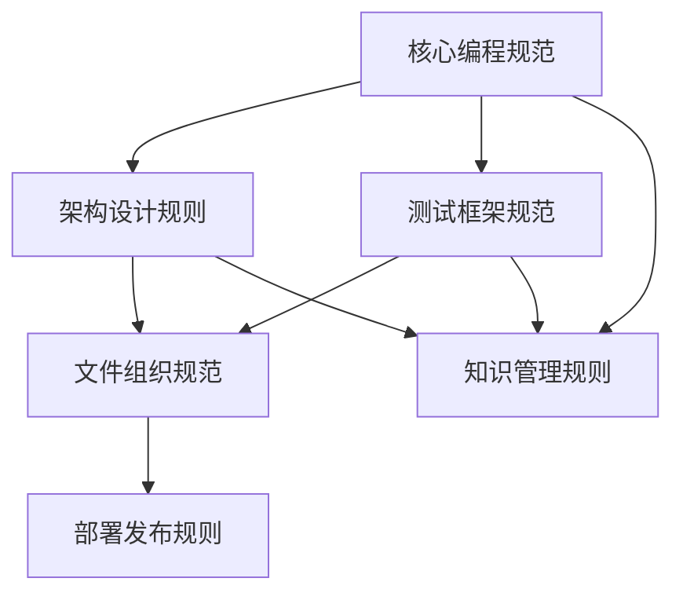

# 🎯 规则治理系统 (Rule Governance System)

## 📋 规则治理概览 (Governance Overview)

### 治理目标
1. **一致性保证**: 确保所有规则文件间的一致性和协调性
2. **版本控制**: 规则版本与项目版本同步管理
3. **质量保证**: 持续监控和改进规则系统质量
4. **使用跟踪**: 监控规则使用情况，优化规则结构

### 治理原则
- **配置驱动**: 规则行为通过配置文件控制
- **版本同步**: 规则版本严格与项目版本保持同步
- **变更记录**: 所有规则变更都有详细的记录和审批
- **影响评估**: 变更前评估对现有代码和流程的影响

## 📊 规则系统架构 (Rules System Architecture)

### 规则分层结构
```
Level 1: 核心原则 (Core Principles)
├── 零硬编码原则
├── 零Fallback原则
└── 用户确认原则

Level 2: 实施规则 (Implementation Rules)  
├── 编程规范
├── 架构设计
├── 测试框架
├── 文件组织
├── 部署发布
└── 知识管理

Level 3: 操作指南 (Operational Guidelines)
├── 工作流程
├── 工具使用
├── 问题解决
└── 最佳实践

Level 4: 项目细节 (Project Details)
├── Provider实现
├── 路由策略
├── 测试策略
└── 性能分析
```

### 规则依赖关系


## 🔄 规则版本管理 (Rule Version Management)

### 版本命名规范
- **规则系统版本**: `v[Major].[Minor].[Patch]-rules`
- **与项目版本对应**: 项目v2.6.0 → 规则v2.6.0-rules
- **独立补丁版本**: 规则修复使用独立的补丁版本号

### 版本控制策略
```json
{
  "ruleSystem": {
    "version": "2.6.0-rules",
    "projectVersion": "2.6.0",
    "lastUpdate": "2025-08-01",
    "maintainer": "Jason Zhang",
    "components": {
      "programming-rules.md": "2.6.0",
      "architecture-rules.md": "2.6.0", 
      "testing-system-rules.md": "2.6.0",
      "file-structure-rules.md": "2.6.0",
      "deployment-rules.md": "2.6.0",
      "memory-system-rules.md": "2.6.0"
    }
  }
}
```

### 变更管理流程
1. **变更提议**: 识别需要修改的规则和原因
2. **影响评估**: 评估变更对现有代码和流程的影响
3. **变更设计**: 设计具体的规则修改方案
4. **审批流程**: 获得项目维护者的审批
5. **实施变更**: 更新规则文件和相关文档
6. **验证测试**: 验证规则变更的有效性
7. **发布通知**: 通知相关人员规则变更

## 🔍 规则质量保证 (Rule Quality Assurance)

### 质量检查维度
1. **一致性检查**: 不同规则文件间的术语和概念一致
2. **完整性检查**: 确保所有重要方面都有规则覆盖
3. **可操作性检查**: 规则具体可执行，不是空泛原则
4. **准确性检查**: 规则内容与实际代码实现一致

### 自动化检查工具
```bash
# 规则一致性检查
./check-rule-consistency.sh

# 规则完整性检查  
./check-rule-completeness.sh

# 规则与代码同步检查
./check-rule-code-sync.sh

# 规则格式检查
./check-rule-format.sh
```

### 质量指标
- **覆盖率**: 规则覆盖的功能和流程百分比 ≥95%
- **一致性**: 术语和概念一致性 100%
- **准确性**: 规则与实际实现一致性 ≥98%
- **可操作性**: 规则可执行性评分 ≥4.5/5.0

## 📈 规则使用监控 (Rule Usage Monitoring)

### 使用统计收集
```typescript
interface RuleUsageStats {
  ruleFile: string;
  accessCount: number;
  lastAccessed: Date;
  averageReadTime: number;
  userFeedback: {
    helpful: number;
    needsImprovement: number;
    confusing: number;
  };
  commonQueries: string[];
  relatedFiles: string[];
}
```

### 监控指标
- **访问频率**: 各规则文件的访问次数和频率
- **使用模式**: 用户最常查阅的规则组合
- **问题反馈**: 规则使用中遇到的问题和建议
- **效果评估**: 规则对开发效率和代码质量的影响

### 优化策略
- **热点规则**: 对高频访问的规则进行优化和细化
- **冷门规则**: 评估低频规则的必要性，可能合并或删除
- **使用体验**: 基于用户反馈改进规则的可读性和可操作性

## 🔧 规则维护工具 (Rule Maintenance Tools)

### 规则管理脚本
```bash
# 规则系统管理
./rule-manager.sh

# 支持的操作
./rule-manager.sh --check-consistency    # 一致性检查
./rule-manager.sh --update-version      # 版本更新
./rule-manager.sh --generate-index      # 生成索引
./rule-manager.sh --validate-links      # 链接验证
./rule-manager.sh --export-summary      # 导出摘要
```

### 规则编辑工具
- **模板生成**: 新规则文件的标准模板
- **格式检查**: Markdown格式和结构检查
- **链接验证**: 内部和外部链接的有效性检查
- **术语检查**: 术语使用的一致性检查

### 规则发布工具
- **变更摘要**: 自动生成规则变更摘要
- **影响分析**: 分析规则变更的影响范围
- **发布包**: 生成规则系统的发布包
- **通知系统**: 自动通知相关人员规则变更

## 📊 规则治理仪表板 (Rule Governance Dashboard)

### 仪表板功能
1. **规则健康度**: 显示规则系统的整体健康状况
2. **使用统计**: 各规则文件的使用情况统计
3. **质量指标**: 规则质量的各项指标展示
4. **变更历史**: 规则变更的历史记录和趋势
5. **用户反馈**: 收集和展示用户对规则的反馈

### 关键指标展示
```json
{
  "overview": {
    "totalRules": 6,
    "totalSections": 127,
    "lastUpdate": "2025-08-01",
    "healthScore": 95.2,
    "completenessScore": 98.5
  },
  "usage": {
    "dailyAccess": 23,
    "weeklyAccess": 156,
    "topRules": [
      "programming-rules.md",
      "testing-system-rules.md", 
      "architecture-rules.md"
    ]
  },
  "quality": {
    "consistencyScore": 100,
    "accuracyScore": 98.2,
    "operabilityScore": 96.8,
    "feedbackScore": 4.6
  }
}
```

## 🔄 规则演进策略 (Rule Evolution Strategy)

### 演进原则
1. **向后兼容**: 新规则不能破坏现有的工作流程
2. **渐进改进**: 采用渐进式改进而非激进变革
3. **用户导向**: 基于实际使用需求演进规则
4. **数据驱动**: 基于使用数据和反馈指导演进

### 演进路径
- **短期(1个月)**: 优化高频使用规则的可读性和可操作性
- **中期(3个月)**: 基于使用模式重组规则结构
- **长期(6个月)**: 集成自动化规则检查和执行工具

### 创新机制
- **试验区**: 设立规则试验区测试新的规则想法
- **反馈循环**: 建立快速的用户反馈和规则改进循环
- **最佳实践**: 持续收集和整理规则使用的最佳实践

## 📋 规则治理检查清单 (Governance Checklist)

### 日常维护检查 (每周)
- [ ] 检查规则文件的内部链接有效性
- [ ] 收集和分析规则使用统计数据
- [ ] 处理用户反馈和建议
- [ ] 更新规则使用频率统计

### 质量保证检查 (每月)
- [ ] 执行规则一致性检查
- [ ] 验证规则与实际代码的同步性
- [ ] 评估规则完整性和覆盖率
- [ ] 更新规则质量指标

### 版本管理检查 (每次发布)
- [ ] 同步规则版本与项目版本
- [ ] 更新规则变更记录
- [ ] 生成规则变更摘要
- [ ] 验证规则发布包完整性

### 治理效果评估 (每季度)
- [ ] 评估规则对开发效率的影响
- [ ] 分析规则使用模式和趋势
- [ ] 制定规则优化改进计划
- [ ] 更新规则治理策略

## 🎯 规则治理成功指标 (Success Metrics)

### 效率指标
- **决策时间**: 开发决策平均时间减少 ≥30%
- **问题解决**: 常见问题解决时间减少 ≥40%
- **学习曲线**: 新人上手时间减少 ≥50%

### 质量指标
- **代码一致性**: 代码风格一致性 ≥95%
- **架构符合度**: 架构规范符合度 ≥98%
- **测试覆盖率**: 测试规范执行率 ≥90%

### 用户满意度
- **规则有用性**: 用户评价 ≥4.5/5.0
- **规则清晰度**: 可理解性评价 ≥4.0/5.0
- **规则可操作性**: 可执行性评价 ≥4.5/5.0

---
**规则治理版本**: v2.6.0-rules  
**治理负责人**: Jason Zhang  
**最后更新**: 2025-08-01