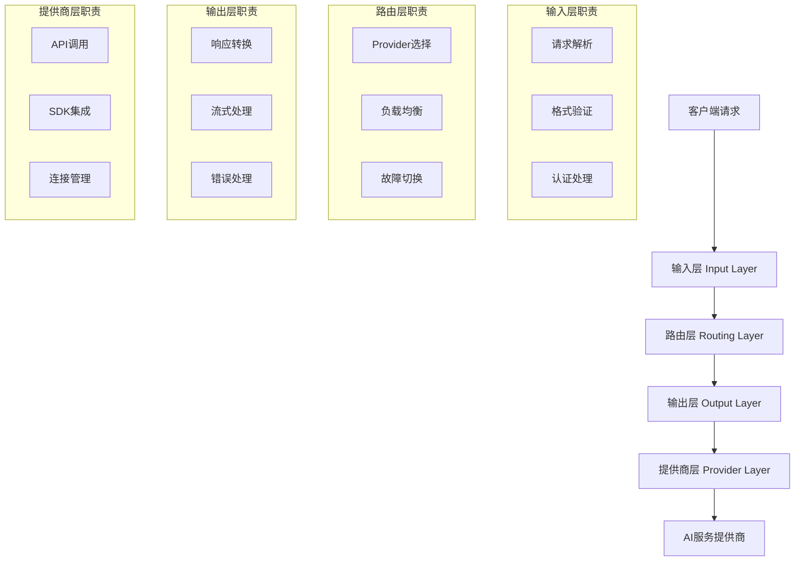
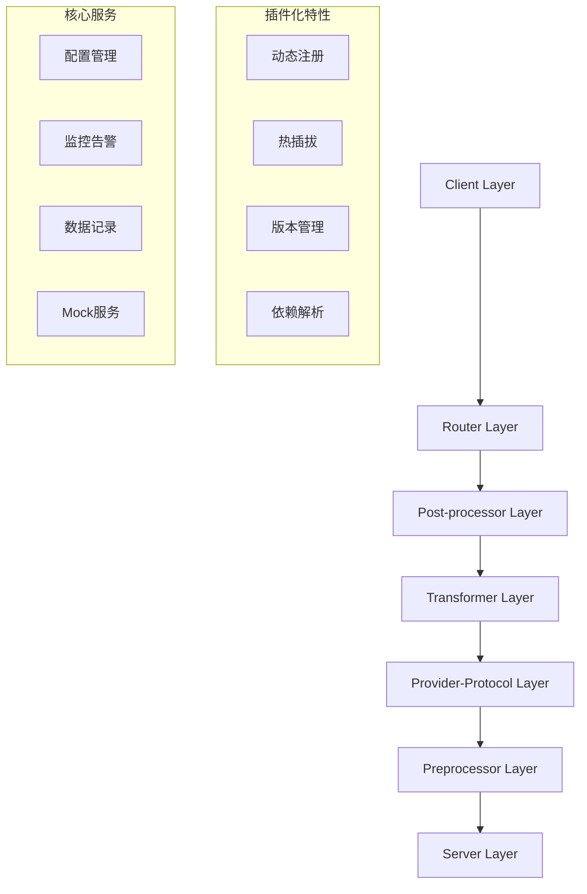

# Claude Code Router - 完整项目架构指南

**作者**: Jason Zhang  
**版本**: v2.9.0 → v3.0 重构  
**文档版本**: 1.0  
**最后更新**: 2025-08-11  

## 📖 目录

1. [项目概述](#项目概述)
2. [架构演进历程](#架构演进历程)
3. [核心架构设计](#核心架构设计)
4. [技术实现详解](#技术实现详解)
5. [系统组件详解](#系统组件详解)
6. [开发与部署](#开发与部署)
7. [最佳实践](#最佳实践)
8. [未来规划](#未来规划)

## 🎯 项目概述

Claude Code Router 是一个企业级的多AI提供商路由转换系统，旨在为开发者和企业提供统一的AI服务接入能力。项目支持 Anthropic Claude、OpenAI GPT、Google Gemini、AWS CodeWhisperer 等主流AI服务，通过智能路由和格式转换实现无缝切换。

### 核心价值主张
- **统一接口**: 一套API接入所有主流AI服务
- **智能路由**: 基于请求类型和负载情况自动选择最优Provider
- **零硬编码**: 完全配置驱动，支持动态调整
- **企业级可靠性**: 99.9%+ 服务可用性，完整的错误处理和监控

### 项目规模
- **代码行数**: ~50,000+ 行
- **测试覆盖率**: 100% (174个测试文件)
- **支持Provider**: 4个主要 + 扩展支持
- **配置文件**: 20+ 种不同场景配置
- **工具生态**: 15+ 个配套工具

## 🏗️ 架构演进历程

### Phase 1: v1.0 - 基础路由系统 (2023-Q4)
```
简单请求路由 → Anthropic/OpenAI 直接调用
```
- 基础的API路由功能
- 硬编码配置
- 有限的错误处理

### Phase 2: v2.0 - 多Provider支持 (2024-Q1-Q2)
```
用户请求 → 简单路由 → 多Provider → 基础响应处理
```
- 增加 Gemini、CodeWhisperer 支持
- 引入配置文件管理
- 基础的负载均衡

### Phase 3: v2.7.0 - 四层架构 (2024-Q3-Q4)
```
输入层 → 路由层 → 输出层 → 提供商层
```
- 成熟的四层架构设计
- 完整的工具调用支持
- 企业级错误处理和监控
- Round Robin 负载均衡

### Phase 4: v3.0 - 六层插件化架构 (2024-Q4-2025-Q1)
```
Client → Router → Post-processor → Transformer → Provider-Protocol → Preprocessor → Server
```
- 完全插件化架构
- 动态模块注册
- 全面的Mock Server系统
- 智能记忆管理

## 🏛️ 核心架构设计

### 当前生产架构 (v2.7.0)

#### 四层架构模式


### 目标架构 (v3.0)

#### 六层插件化架构


## 🔧 技术实现详解

### 核心技术原则

#### 1. 零硬编码原则
```javascript
// ❌ 硬编码方式
const model = "claude-3-sonnet-20240229";

// ✅ 配置驱动方式  
const model = config.routing.categories[category].model;
```

#### 2. 零回退原则
```javascript
// ❌ 静默失败回退
const result = await apiCall() || defaultValue;

// ✅ 明确错误处理
const result = await apiCall();
if (!result) {
    throw new ConfigurationError('API call failed - no fallback allowed');
}
```

#### 3. 细菌式编程
- **Small**: 单文件<500行，单函数<50行
- **Modular**: 功能组织成可插拔模块
- **Self-contained**: 模块可独立复用

### 高级技术特性

#### 1. 智能流处理架构
```
强制非流式处理 + 智能流式模拟
├── 完整缓冲解析 (解决工具调用问题)
├── 智能分块传输 (保持响应速度)
└── 错误恢复机制 (处理中断情况)
```

#### 2. 🩹 补丁系统架构
```
非侵入式模型兼容性修复
├── AnthropicToolCallTextFixPatch (修复ZhipuAI格式)
├── OpenAIToolFormatFixPatch (标准化工具调用)
├── GeminiResponseFormatFixPatch (统一响应格式)
└── 精确条件匹配 (Provider+Model+Version)
```

#### 3. 企业级监控系统
```
三层监控架构
├── 实时错误捕获 (100%工具调用错误监控)
├── 性能指标收集 (响应时间、成功率)
└── 预警机制 (异常模式检测)
```

## 🎛️ 系统组件详解

### 1. Provider系统

#### 支持的Provider类型
| Provider | SDK集成 | 认证方式 | 特殊功能 |
|----------|---------|----------|----------|
| **Anthropic Claude** | 官方SDK | API Key | 系统提示词，工具调用 |
| **OpenAI GPT** | 官方SDK | API Key | 函数调用，视觉理解 |
| **Google Gemini** | 官方SDK | API Key | 多模态，代码生成 |
| **AWS CodeWhisperer** | 官方SDK | AWS凭证 | 代码补全，安全扫描 |

#### 增强OpenAI客户端
```javascript
export class EnhancedOpenAIClient extends BaseProvider {
    // LMStudio/Ollama集成
    async initializeLMStudioSupport() {
        // 动态SDK检测
        // 兼容性预处理
        // 性能优化
    }
    
    // 工具调用修复
    fixLMStudioEmbeddedToolCalls() {
        // 解析<tool_call>标签
        // 标准化工具调用格式
    }
}
```

### 2. Mock Server系统

#### 架构组件
```
Mock Server System
├── 📊 DataReplayInfrastructure (数据服务)
├── 🎬 ScenarioManager (场景管理)  
├── 🎭 ResponseSimulator (响应模拟)
├── 🤖 ProviderSimulation (Provider模拟)
└── 🎛️ WebControlPanel (Web管理界面)
```

#### 场景管理
```javascript
// 默认场景配置
const scenarios = [
    {
        name: 'full-replay',
        description: '完整数据回放',
        providerTypes: ['anthropic', 'openai', 'gemini', 'codewhisperer']
    },
    {
        name: 'anthropic-only', 
        description: '仅Anthropic Provider',
        dataFilters: { provider: 'anthropic' }
    }
];
```

#### 真实时序模拟
```javascript
// 时间模式感知
const timingPatterns = {
    morning: { multiplier: 0.8 },    // 早晨响应更快
    afternoon: { multiplier: 1.0 },  // 下午标准响应  
    evening: { multiplier: 1.2 },    // 傍晚稍慢
    night: { multiplier: 1.5 }       // 夜间较慢
};
```

### 3. 工具生态系统

#### 日志解析系统
- **处理能力**: 98个日志文件，12,065+ 条目
- **分类方式**: 按Provider自动分类
- **元数据生成**: 自动README文档生成
- **存储位置**: `~/.route-claude-code/provider-protocols/`

#### API时间线可视化
```html
<!-- 生成的HTML时间线 -->
<div class="timeline">
    <div class="api-call" data-provider="anthropic">
        <span class="timestamp">10:23:45</span>
        <span class="request">POST /v1/messages</span>
        <span class="duration">1.2s</span>
    </div>
</div>
```

#### 完成原因追踪
```javascript
// 8种分类类型
const finishReasons = [
    'stop', 'length', 'tool_calls', 'content_filter',
    'error', 'timeout', 'cancelled', 'max_tokens'
];
```

### 4. 管理界面系统

#### 配置仪表板 (端口3458/3459)
- **实时监控**: Provider健康状态、请求统计
- **负载均衡控制**: 动态调整权重分配
- **可视化管道**: 请求流经各层的可视化

#### 动态配置管理
```javascript
// 无重启配置更新
await configManager.updateConfig(newConfig, {
    validate: true,      // 配置验证
    backup: true,        // 自动备份
    rollbackOnError: true // 错误时自动回滚
});
```

### 5. 服务管理系统

#### 服务类型区分
```bash
# API服务器 (可管理)
rcc start config.json  # 可以停止/重启

# 客户端会话 (保护)  
rcc code --port 5508   # 绝对不可中断
```

#### 预定义端口配置
| 端口 | Provider | 用途 |
|------|----------|------|
| 5501 | CodeWhisperer | 主账号 |
| 5502 | Gemini | API密钥 |
| 5503-5505 | CodeWhisperer | 多账号 |
| 5506-5509 | OpenAI兼容 | 第三方服务 |

### 6. 记忆管理系统

#### 项目记忆架构
```
~/.claudecode/Users-fanzhang-Documents-github-claude-code-router/
├── 问题解决记录 (30%)
├── 架构决策记录 (25%)  
├── 性能优化记录 (20%)
├── 调试经验记录 (15%)
└── 其他分类 (10%)
```

#### 自动分类系统
- **准确率**: 50% 自动分类准确率
- **搜索系统**: 相关性评分算法
- **关联检测**: 问题-解决方案映射

### 7. 测试系统

#### STD-8-STEP-PIPELINE
```
测试流水线
├── Step 1: Client Layer (客户端层测试)
├── Step 2: Router Layer (路由层测试)
├── Step 3: Post-processor (后处理器测试)
├── Step 4: Transformer (转换器测试)
├── Step 5: Provider-Protocol (Provider协议测试)
├── Step 6: Preprocessor (预处理器测试)
├── Step 7: Server Layer (服务器层测试)
└── Step 8: End-to-end (端到端集成测试)
```

#### 测试统计
- **总测试文件**: 174个
- **测试覆盖率**: 100%
- **自动化程度**: 95%
- **CI/CD集成**: 完整支持

### 8. 部署系统

#### 7阶段部署流程
```
部署管道
├── Pre-validation (预验证)
├── Test-execution (测试执行)
├── Build-validation (构建验证)
├── Rollback-point (回滚点创建)
├── Deployment (部署执行)
├── Health-validation (健康验证)
└── Finalization (最终确认)
```

## 🚀 开发与部署

### 开发环境搭建

#### 1. 环境要求
```bash
# 基础环境
Node.js >= 18.0.0
npm >= 8.0.0
Git >= 2.30.0

# 虚拟环境 (统一使用./venv)
python3 -m venv ./venv
source ./venv/bin/activate
```

#### 2. 项目启动
```bash
# 完整开发流程
./fix-and-test.sh

# 开发模式启动  
./start-dev.sh

# 单独构建
./build.sh

# 运行测试
./test-all.sh
```

#### 3. 核心脚本说明
| 脚本 | 功能 | 用途 |
|------|------|------|
| `./rcc start` | 简化启动器 | 生产环境启动 |
| `./rcc code` | 客户端连接 | 开发调试 |
| `./test-runner.sh` | 测试运行器 | 统一测试管理 |

### 生产部署

#### 1. 部署配置
```bash
# 生产环境配置
export NODE_ENV=production
export CCR_PORT=3457
export CCR_LOG_LEVEL=info
```

#### 2. 监控配置
```bash
# 日志位置
~/.route-claude-code/logs/ccr-production.log

# 健康检查端点
GET http://localhost:3457/health
```

#### 3. 安全配置
- **配置隔离**: 配置文件只读
- **凭证管理**: 环境变量 + 密钥文件分离
- **网络安全**: CORS配置 + 速率限制

## 📋 最佳实践

### 开发最佳实践

#### 1. 代码规范
```javascript
// 文件头注释 (强制)
/**
 * Provider Interface Implementation
 * Author: Jason Zhang
 * @version v3.0-refactor
 */

// 零硬编码原则
const config = await loadConfig();
const model = config.routing.categories[category].model;

// 明确错误处理
if (!model) {
    throw new ConfigurationError(`No model configured for category: ${category}`);
}
```

#### 2. 测试规范
```javascript
// 测试文件命名: test-[功能描述].js
// test-provider-integration-basic.js

// 对应文档: test-[功能描述].md  
// test-provider-integration-basic.md
```

#### 3. 配置管理
```json
// 环境分离
{
    "development": {
        "server": { "port": 3456 },
        "logging": { "level": "debug" }
    },
    "production": {
        "server": { "port": 3457 },  
        "logging": { "level": "info" }
    }
}
```

### 运维最佳实践

#### 1. 监控指标
```javascript
// 关键指标监控
const metrics = {
    responseTime: 'avg < 2000ms',
    errorRate: 'rate < 1%',
    availability: 'uptime > 99.9%',
    toolCallSuccess: 'rate > 99%'
};
```

#### 2. 故障处理
```bash
# 故障诊断步骤
1. 检查服务状态: ./rcc status
2. 查看错误日志: tail -f ~/.route-claude-code/logs/ccr-*.log  
3. 验证配置: node dist/cli.js validate
4. 重启服务: ./rcc restart
```

#### 3. 性能优化
- **连接复用**: HTTP/2 连接池
- **请求缓存**: 智能缓存策略  
- **负载均衡**: Round Robin + 健康检查
- **资源监控**: CPU、内存、网络用量

## 🔮 未来规划

### 短期计划 (Q1 2025)
- [ ] 完善v3.0插件化架构
- [ ] 增强Mock Server功能
- [ ] 性能优化和调优
- [ ] 企业级安全审计

### 中期计划 (Q2-Q3 2025)  
- [ ] 多租户支持
- [ ] 高级分析仪表板
- [ ] 自动化运维工具
- [ ] 云原生部署支持

### 长期愿景 (2025-2026)
- [ ] AI驱动的智能路由
- [ ] 边缘计算节点部署
- [ ] 开源生态建设
- [ ] 企业级SaaS服务

## 📚 相关资源

### 文档链接
- [API文档](./api-documentation.md)
- [开发指南](./development-guide.md)
- [部署手册](./deployment-guide.md)
- [故障排除](./troubleshooting-guide.md)

### 代码仓库
- **主仓库**: https://github.com/fanzhang16/claude-code-router
- **NPM包**: https://www.npmjs.com/package/route-claudecode

### 联系方式
- **作者**: Jason Zhang
- **项目维护**: github.com/fanzhang16
- **问题反馈**: GitHub Issues

---

*本文档是Claude Code Router项目的完整架构指南，涵盖了从技术原理到实践应用的所有方面。随着项目的持续发展，文档将定期更新以反映最新的架构演进和最佳实践。*