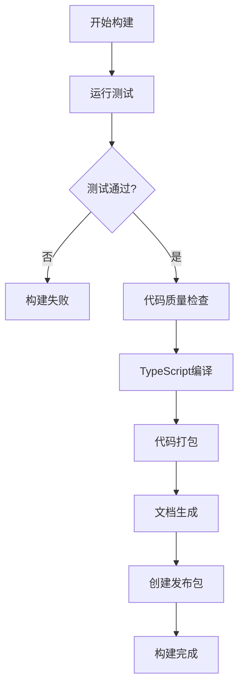
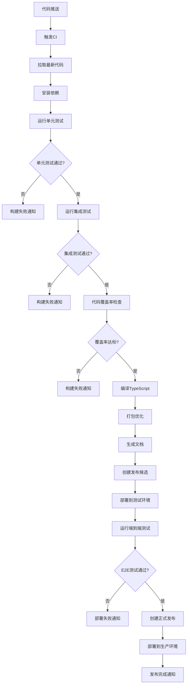

# 构建模块 (Build Module)

## 模块概述

构建模块是RCC v4.0系统的构建和发布管理中心，负责项目的编译、打包、测试、文档生成和发布流程管理。

## 模块职责

1. **编译管理**: 管理TypeScript编译和代码转换
2. **打包管理**: 管理项目打包和优化
3. **测试执行**: 执行自动化测试和质量检查
4. **文档生成**: 自动生成API文档和用户文档
5. **发布管理**: 管理版本发布和分发
6. **构建监控**: 监控构建过程和性能指标

## 模块结构

```
build/
├── README.md                          # 本模块设计文档
├── index.ts                           # 模块入口和导出
├── build-manager.ts                   # 构建管理器
├── compiler.ts                        # 编译器
├── packager.ts                        # 打包器
├── tester.ts                          # 测试器
├── doc-generator.ts                    # 文档生成器
├── release-manager.ts                 # 发布管理器
├── build-monitor.ts                   # 构建监控器
├── build-config.ts                    # 构建配置
├── build-scripts/                     # 构建脚本
│   ├── compile.ts                      # 编译脚本
│   ├── bundle.ts                      # 打包脚本
│   ├── test.ts                        # 测试脚本
│   ├── docs.ts                        # 文档脚本
│   └── release.ts                     # 发布脚本
├── configs/                           # 构建配置文件
│   ├── tsconfig.base.json             # 基础TS配置
│   ├── tsconfig.prod.json             # 生产TS配置
│   ├── webpack.base.js                # 基础Webpack配置
│   ├── webpack.prod.js                # 生产Webpack配置
│   ├── jest.config.js                 # Jest测试配置
│   └── typedoc.json                   # TypeDoc配置
├── templates/                         # 构建模板
│   ├── package.json.template           # Package模板
│   ├── readme.md.template             # README模板
│   └── license.template               # 许可证模板
└── reports/                           # 构建报告
    ├── build/                         # 构建报告
    ├── test/                          # 测试报告
    ├── coverage/                      # 覆盖率报告
    └── performance/                   # 性能报告
```

## 核心组件

### 构建管理器 (BuildManager)
负责构建流程的整体协调和管理，是模块的主入口点。

### 编译器 (Compiler)
管理TypeScript编译过程，支持增量编译和热重载。

### 打包器 (Packager)
负责项目打包和优化，支持多种输出格式。

### 测试器 (Tester)
执行自动化测试和质量检查。

### 文档生成器 (DocGenerator)
自动生成API文档和用户文档。

### 发布管理器 (ReleaseManager)
管理版本发布和分发流程。

### 构建监控器 (BuildMonitor)
监控构建过程和性能指标。

## 构建流程

### 完整构建流程


### CI/CD集成流程


## 构建配置

### TypeScript配置
```json
// tsconfig.base.json
{
  "compilerOptions": {
    "target": "ES2022",
    "module": "commonjs",
    "lib": ["ES2022"],
    "strict": true,
    "esModuleInterop": true,
    "skipLibCheck": true,
    "forceConsistentCasingInFileNames": true,
    "declaration": true,
    "declarationMap": true,
    "sourceMap": true,
    "outDir": "./dist",
    "rootDir": "./src",
    "removeComments": false,
    "noUnusedLocals": true,
    "noUnusedParameters": true,
    "noImplicitReturns": true,
    "noFallthroughCasesInSwitch": true,
    "moduleResolution": "node",
    "resolveJsonModule": true,
    "isolatedModules": true,
    "allowSyntheticDefaultImports": true
  },
  "include": [
    "src/**/*"
  ],
  "exclude": [
    "node_modules",
    "dist",
    "**/*.test.ts",
    "**/__tests__/**"
  ]
}
```

### Webpack配置
```javascript
// webpack.prod.js
const path = require('path');
const TerserPlugin = require('terser-webpack-plugin');

module.exports = {
  mode: 'production',
  entry: './src/index.ts',
  output: {
    path: path.resolve(__dirname, '../dist'),
    filename: 'rcc.min.js',
    library: 'RCC',
    libraryTarget: 'umd',
    globalObject: 'this'
  },
  resolve: {
    extensions: ['.ts', '.js'],
    modules: [path.resolve(__dirname, '../src'), 'node_modules']
  },
  module: {
    rules: [
      {
        test: /\.ts$/,
        use: 'ts-loader',
        exclude: /node_modules/
      }
    ]
  },
  optimization: {
    minimize: true,
    minimizer: [
      new TerserPlugin({
        terserOptions: {
          compress: {
            drop_console: true,
            drop_debugger: true,
            pure_funcs: ['console.log']
          },
          mangle: true
        }
      })
    ]
  },
  performance: {
    maxAssetSize: 500000,
    maxEntrypointSize: 500000
  }
};
```

### 测试配置
```javascript
// jest.config.js
module.exports = {
  preset: 'ts-jest',
  testEnvironment: 'node',
  roots: ['<rootDir>/src'],
  testMatch: [
    '**/__tests__/**/*.+(ts|tsx|js)',
    '**/?(*.)+(spec|test).+(ts|tsx|js)'
  ],
  transform: {
    '^.+\\.(ts|tsx)$': 'ts-jest'
  },
  collectCoverageFrom: [
    'src/**/*.{ts,tsx}',
    '!src/**/*.d.ts',
    '!src/**/index.ts',
    '!src/**/__tests__/**'
  ],
  coverageDirectory: 'coverage',
  coverageReporters: ['text', 'lcov', 'html'],
  coverageThreshold: {
    global: {
      branches: 80,
      functions: 85,
      lines: 85,
      statements: 85
    }
  },
  setupFilesAfterEnv: ['<rootDir>/src/__tests__/setup.ts']
};
```

## 构建脚本

### 编译脚本
```typescript
// compile.ts
import { Compiler } from './compiler';

async function compile(): Promise<void> {
  const compiler = new Compiler();
  
  try {
    console.log('🔍 Starting TypeScript compilation...');
    
    // 1. 检查配置文件
    await compiler.validateConfig();
    
    // 2. 执行编译
    const result = await compiler.compile();
    
    // 3. 验证输出
    await compiler.validateOutput();
    
    console.log('✅ TypeScript compilation completed successfully!');
    console.log(`📦 Compiled ${result.files} files in ${result.duration}ms`);
    console.log(`💾 Output size: ${result.outputSize} bytes`);
    
  } catch (error) {
    console.error('❌ TypeScript compilation failed:', error.message);
    process.exit(1);
  }
}

compile();
```

### 打包脚本
```typescript
// bundle.ts
import { Packager } from './packager';

async function bundle(): Promise<void> {
  const packager = new Packager();
  
  try {
    console.log('📦 Starting bundling process...');
    
    // 1. 清理输出目录
    await packager.cleanOutput();
    
    // 2. 执行打包
    const result = await packager.bundle();
    
    // 3. 优化输出
    await packager.optimize(result);
    
    // 4. 验证打包结果
    await packager.validateBundle(result);
    
    console.log('✅ Bundling completed successfully!');
    console.log(`📊 Bundle size: ${result.size} bytes`);
    console.log(`📈 Compression ratio: ${(result.compressionRatio * 100).toFixed(2)}%`);
    
  } catch (error) {
    console.error('❌ Bundling failed:', error.message);
    process.exit(1);
  }
}

bundle();
```

### 测试脚本
```typescript
// test.ts
import { Tester } from './tester';

async function runTests(): Promise<void> {
  const tester = new Tester();
  
  try {
    console.log('🧪 Starting test execution...');
    
    // 1. 运行单元测试
    const unitResults = await tester.runUnitTests();
    
    // 2. 运行集成测试
    const integrationResults = await tester.runIntegrationTests();
    
    // 3. 运行端到端测试
    const e2eResults = await tester.runE2ETests();
    
    // 4. 生成覆盖率报告
    const coverageReport = await tester.generateCoverageReport();
    
    // 5. 汇总测试结果
    const summary = tester.summarizeResults([unitResults, integrationResults, e2eResults]);
    
    console.log('✅ All tests completed!');
    console.log(`📊 Summary: ${summary.passed}/${summary.total} tests passed`);
    console.log(`📈 Coverage: ${coverageReport.lines.percentage}% lines, ${coverageReport.functions.percentage}% functions`);
    
    // 6. 检查质量门禁
    const qualityGatePassed = tester.checkQualityGates(summary, coverageReport);
    if (!qualityGatePassed) {
      console.error('❌ Quality gate failed!');
      process.exit(1);
    }
    
  } catch (error) {
    console.error('❌ Test execution failed:', error.message);
    process.exit(1);
  }
}

runTests();
```

### 发布脚本
```typescript
// release.ts
import { ReleaseManager } from './release-manager';

async function createRelease(version: string): Promise<void> {
  const releaseManager = new ReleaseManager();
  
  try {
    console.log(`🚀 Creating release ${version}...`);
    
    // 1. 验证版本号
    await releaseManager.validateVersion(version);
    
    // 2. 运行完整构建流程
    await releaseManager.runFullBuild();
    
    // 3. 创建发布候选
    const candidate = await releaseManager.createReleaseCandidate(version);
    
    // 4. 运行发布前测试
    await releaseManager.runPreReleaseTests(candidate);
    
    // 5. 生成发布包
    const releasePackage = await releaseManager.generateReleasePackage(candidate);
    
    // 6. 发布到NPM
    await releaseManager.publishToNPM(releasePackage);
    
    // 7. 创建GitHub Release
    await releaseManager.createGitHubRelease(releasePackage);
    
    // 8. 发送发布通知
    await releaseManager.sendReleaseNotification(version);
    
    console.log(`✅ Release ${version} published successfully!`);
    
  } catch (error) {
    console.error(`❌ Release ${version} failed:`, error.message);
    process.exit(1);
  }
}

// 从命令行参数获取版本号
const version = process.argv[2];
if (!version) {
  console.error('❌ Please provide a version number');
  process.exit(1);
}

createRelease(version);
```

## 构建监控

### 性能监控
```typescript
// build-monitor.ts
class BuildMonitor {
  private metrics: BuildMetrics[] = [];
  
  async monitorBuild(buildId: string, buildProcess: Promise<void>): Promise<BuildMetrics> {
    const startTime = Date.now();
    const startMemory = process.memoryUsage();
    
    try {
      // 执行构建过程
      await buildProcess;
      
      const endTime = Date.now();
      const endMemory = process.memoryUsage();
      
      const metrics: BuildMetrics = {
        buildId,
        duration: endTime - startTime,
        memoryUsage: {
          start: startMemory,
          end: endMemory,
          peak: this.getPeakMemoryUsage()
        },
        cpuUsage: this.getCPUUsage(),
        fileCount: this.getFileCount(),
        outputSize: this.getOutputSize(),
        timestamp: new Date()
      };
      
      this.metrics.push(metrics);
      await this.saveMetrics(metrics);
      
      return metrics;
      
    } catch (error) {
      const endTime = Date.now();
      const errorMetrics: BuildMetrics = {
        buildId,
        duration: endTime - startTime,
        memoryUsage: {
          start: startMemory,
          end: process.memoryUsage(),
          peak: this.getPeakMemoryUsage()
        },
        cpuUsage: this.getCPUUsage(),
        error: error.message,
        timestamp: new Date()
      };
      
      this.metrics.push(errorMetrics);
      await this.saveMetrics(errorMetrics);
      
      throw error;
    }
  }
  
  async generateBuildReport(buildId?: string): Promise<BuildReport> {
    const metrics = buildId 
      ? this.metrics.filter(m => m.buildId === buildId)
      : this.metrics;
      
    return {
      builds: metrics.length,
      avgDuration: this.calculateAverageDuration(metrics),
      peakMemory: this.getPeakMemoryUsage(metrics),
      successRate: this.calculateSuccessRate(metrics),
      mostRecent: metrics[metrics.length - 1],
      history: metrics
    };
  }
}
```

## 接口定义

```typescript
interface BuildModuleInterface {
  initialize(): Promise<void>;
  compile(options?: CompileOptions): Promise<CompileResult>;
  bundle(options?: BundleOptions): Promise<BundleResult>;
  test(options?: TestOptions): Promise<TestResult>;
  generateDocs(options?: DocOptions): Promise<DocResult>;
  build(options?: BuildOptions): Promise<BuildResult>;
  release(version: string, options?: ReleaseOptions): Promise<ReleaseResult>;
  getBuildMetrics(buildId?: string): Promise<BuildMetrics[]>;
  generateBuildReport(buildId?: string): Promise<BuildReport>;
}

interface CompilerInterface {
  compile(): Promise<CompileResult>;
  validateConfig(): Promise<boolean>;
  validateOutput(): Promise<boolean>;
  getCompilationDiagnostics(): Diagnostic[];
}

interface PackagerInterface {
  bundle(): Promise<BundleResult>;
  optimize(bundle: BundleResult): Promise<BundleResult>;
  validateBundle(bundle: BundleResult): Promise<boolean>;
  cleanOutput(): Promise<void>;
}

interface TesterInterface {
  runUnitTests(): Promise<TestResult>;
  runIntegrationTests(): Promise<TestResult>;
  runE2ETests(): Promise<TestResult>;
  runPerformanceTests(): Promise<TestResult>;
  generateCoverageReport(): Promise<CoverageReport>;
  summarizeResults(results: TestResult[]): TestSummary;
  checkQualityGates(summary: TestSummary, coverage: CoverageReport): boolean;
}

interface ReleaseManagerInterface {
  createReleaseCandidate(version: string): Promise<ReleaseCandidate>;
  runPreReleaseTests(candidate: ReleaseCandidate): Promise<TestResult>;
  generateReleasePackage(candidate: ReleaseCandidate): Promise<ReleasePackage>;
  publishToNPM(package: ReleasePackage): Promise<void>;
  createGitHubRelease(package: ReleasePackage): Promise<void>;
  sendReleaseNotification(version: string): Promise<void>;
}
```

## 依赖关系

- 依赖配置模块获取构建配置
- 依赖测试模块执行自动化测试
- 依赖文档模块生成API文档
- 被CI/CD系统调用以执行自动化构建

## 设计原则

1. **可靠性**: 确保构建过程的稳定性和可重复性
2. **性能优化**: 优化构建性能，减少构建时间
3. **质量保证**: 集成质量检查和测试验证
4. **可配置性**: 支持灵活的构建配置和定制
5. **可观测性**: 提供详细的构建监控和报告
6. **安全性**: 确保构建产物的安全性和完整性
7. **标准化**: 遵循业界标准的构建实践
8. **自动化**: 支持完整的自动化构建和发布流程