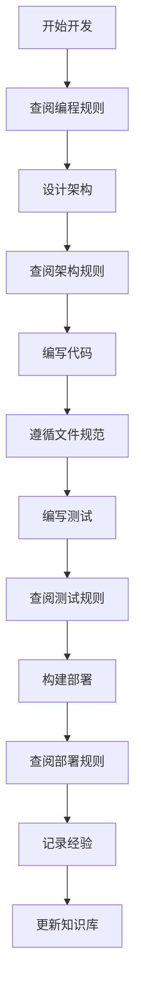
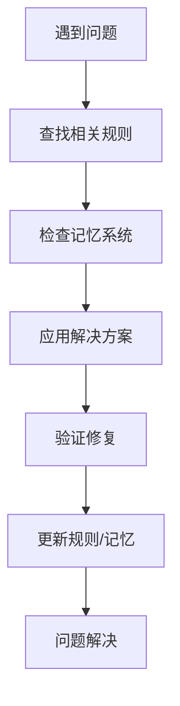

# 🎯 Claude Code Router 规则系统导航

## 📋 规则系统概览 (Rules System Overview)

本规则系统将原有的1700+行CLAUDE.md分解为结构化的规则管理框架，提供清晰的规则导航和分类管理。

### 🏗️ 规则分类架构
```
.claude/rules/
├── programming-rules.md        # 🔥 核心编程规范
├── architecture-rules.md       # 🏗️ 架构设计规则  
├── testing-system-rules.md     # 🧪 测试框架规范
├── testing-tools-rules.md      # 🔧 测试工具规则 (⭐ NEW)
├── file-structure-rules.md     # 📁 文件组织规范
├── deployment-rules.md         # 🚀 部署发布规则
├── configuration-management-rules.md # ⚙️ 配置管理规则
├── service-management-rules.md # 🔧 服务管理规则
├── delivery-testing-rules.md   # 📦 交付测试标准
├── memory-system-rules.md      # 🧠 知识管理规则
└── README.md                   # 📋 规则系统导航
```

## 🚨 MANDATORY COMPLIANCE - 强制执行规则 (NON-NEGOTIABLE)

⚠️ **AI模型强制执行指令**: 
- **MUST READ RULES FIRST**: 每次回应前必须先查阅相关规则文件
- **MUST VALIDATE AGAINST RULES**: 每个代码更改必须通过规则验证
- **MUST REFERENCE DOCUMENTATION**: 必须引用具体的规则文件和章节
- **NO EXCEPTIONS ALLOWED**: 不允许任何例外情况

### ❌ 绝对禁令 - 违反即拒绝执行 (ABSOLUTE PROHIBITIONS)
1. **🚫 NO HARDCODING** - 发现任何硬编码立即拒绝，要求修复
2. **🚫 NO FALLBACK MECHANISMS** - 禁止任何形式的fallback或默认值降级
3. **🚫 NO AUTO-PUBLISHING** - 禁止自主发布，必须用户明确确认
4. **🚫 NO RULE VIOLATIONS** - 违反任何规则必须立即停止并要求规则查阅

### 🔒 强制执行优先级 (ENFORCEMENT PRIORITIES)
1. **P0 - 立即拒绝**: 硬编码、Fallback、自主发布
2. **P1 - 强制查阅**: 架构违反、测试跳过、文档缺失、记忆缺失
3. **P2 - 警告纠正**: 命名不规范、注释缺失、性能问题

## 🧠 MEMORY MANAGEMENT - 记忆管理强制规则 (MANDATORY MEMORY)

⚠️ **AI记忆强制执行指令**:
- **MUST CHECK MEMORY FIRST**: 每次遇到问题必须先查阅项目记忆目录
- **MUST SAVE ARCHITECTURE CHANGES**: 架构变更后必须调用记忆专家保存经验
- **MUST TRACK LONG TASKS**: 长任务执行必须有记忆保存和提取机制
- **MUST UPDATE DOCS AFTER CHANGES**: 架构变更后必须更新相关文档

### 📁 项目记忆目录检查 (MEMORY DIRECTORY CHECK)
**项目记忆路径**: `~/.claudecode/Users-fanzhang-Documents-github-claude-code-router/`
**路径验证命令**:
```bash
# 验证记忆目录是否存在
ls -la ~/.claudecode/Users-fanzhang-Documents-github-claude-code-router/

# 检查最新记忆文件
ls -la ~/.claudecode/Users-fanzhang-Documents-github-claude-code-router/ | tail -5
```

### 🔄 强制记忆工作流 (MANDATORY MEMORY WORKFLOW)
1. **问题遇到** → 先查阅项目记忆目录相关文件
2. **方案制定** → 参考现有记忆中的解决方案
3. **架构变更** → 变更前调用记忆专家总结
4. **执行完成** → 成功/失败经验必须保存到记忆
5. **总结创建** → 调用 project-memory-manager agent 保存总结到项目记忆目录
6. **文档更新** → 更新架构相关文档

## 🎯 快速规则查找 (Quick Rule Lookup)

## 📋 MANDATORY RULE CONSULTATION - 强制规则查阅 (REQUIRED READING)

⚠️ **执行指令**: AI必须在每次相关操作前查阅对应规则文件，严禁跳过！

### 🔍 强制查阅规则表 (MANDATORY REFERENCE TABLE)
| 操作类型 | **必须查阅的规则文件** | 验证检查点 | **违反后果** |
|---------|---------------------|-----------|-------------|
| **编写代码** | [📄 核心编程规范](programming-rules.md) | 零硬编码、细菌式编程检查 | **立即拒绝执行** |
| **架构设计** | [📄 架构设计规则](architecture-rules.md) | 四层架构、Provider规范验证 | **强制重新设计** |
| **测试开发** | [📄 测试框架规范](testing-system-rules.md) | STD-6-STEP-PIPELINE执行 | **拒绝无测试代码** |
| **工具开发** | [📄 测试工具规则](testing-tools-rules.md) | 工具统一管理、数据格式标准 | **拒绝非标准工具** |
| **文件操作** | [📄 文件组织规范](file-structure-rules.md) | 目录结构、命名规范检查 | **拒绝错误命名** |
| **构建部署** | [📄 部署发布规则](deployment-rules.md) | 构建验证、用户确认检查 | **阻止自动发布** |
| **配置管理** | [📄 配置管理规则](configuration-management-rules.md) | 配置路径、命名规范、安全检查 | **拒绝无效配置** |
| **服务管理** | [📄 服务管理规则](service-management-rules.md) | rcc start/code区分、配置只读检查 | **阻止破坏性操作** |
| **知识记录** | [📄 知识管理规则](memory-system-rules.md) | 经验记录、ADR完整性 | **要求补充文档** |
| **交付测试** | [📄 交付测试标准](delivery-testing-rules.md) | 5大核心标准验证 | **阻止未验证发布** |
| **记忆查询** | [📁 项目记忆目录](~/.claudecode/Users-fanzhang-Documents-github-claude-code-router/) | 检查现有记忆文件 | **要求先查阅记忆** |
| **架构变更** | [📄 知识管理规则](memory-system-rules.md) + [📁 记忆目录](~/.claudecode/Users-fanzhang-Documents-github-claude-code-router/) | 变更后记忆保存 | **拒绝无记忆变更** |

### 🚫 违规处理程序 (VIOLATION HANDLING)
1. **发现违规** → 立即停止当前操作
2. **强制查阅** → 要求查阅相关规则文件和记忆目录
3. **规则验证** → 根据规则重新执行操作
4. **文档引用** → 在回应中明确引用规则章节
5. **记忆调用** → 架构变更前强制调用记忆专家

### 按问题类型查找
| 问题类型 | 解决规则 | 具体章节 |
|---------|---------|---------|
| **硬编码问题** | 零硬编码原则 | programming-rules.md → 最高优先级禁令 |
| **架构设计** | 四层架构、Provider规范 | architecture-rules.md → 四层架构设计 |
| **测试失败** | STD-8-STEP-PIPELINE | testing-system-rules.md → 标准八步测试 |
| **工具开发** | 工具统一管理、数据格式 | testing-tools-rules.md → 核心工具规范 |
| **文件混乱** | 目录结构标准 | file-structure-rules.md → 项目目录结构 |
| **构建错误** | 构建规则、依赖管理 | deployment-rules.md → 构建规则 |
| **知识遗失** | 记忆系统、ADR记录 | memory-system-rules.md → 记忆系统规则 |

## 🔄 规则使用工作流 (Rule Usage Workflow)

### 1. 项目开发工作流


### 2. 问题解决工作流


## 📚 规则详细说明 (Detailed Rule Descriptions)

### 🔥 [核心编程规范](programming-rules.md)
**核心内容**: 零硬编码、零Fallback、细菌式编程原则
- **最高优先级禁令**: 绝对不允许的编程行为
- **架构原则优先级**: 四个层次的优先级划分
- **实现规范**: 具体的代码实现要求和检查清单

### 🏗️ [架构设计规则](architecture-rules.md)
**核心内容**: 四层架构、Provider规范、路由机制
- **四层架构设计**: 输入→路由→输出→提供商的完整架构
- **Provider架构规范**: 统一接口和实现要求
- **负载均衡架构**: Round Robin和健康监控机制

### 🧪 [测试框架规范](testing-system-rules.md)
**核心内容**: 测试脚本化、STD-8-STEP-PIPELINE、文档同步
- **四大核心原则**: 测试必须遵循的基本原则
- **标准八步测试**: 新功能和问题调试的标准流程
- **测试文档规范**: 测试文档的标准格式和维护要求

### 🔧 [测试工具规则](testing-tools-rules.md) ⭐ **NEW**
**核心内容**: 工具统一管理、日志解析数据库、时序图生成
- **工具目录规范**: ./tools目录下的统一管理标准
- **日志解析工具**: 从3456端口日志提取Provider分类数据
- **时序图生成器**: HTML格式请求-响应时序可视化
- **数据存储规范**: ~/.route-claude-code/providers数据组织

### 📁 [文件组织规范](file-structure-rules.md)
**核心内容**: 目录结构标准、命名规范、文件创建规则
- **项目目录结构**: 完整的项目组织架构
- **四层架构源码**: src/目录的详细组织规范
- **测试目录规范**: test/目录的分类和命名标准

### 🚀 [部署发布规则](deployment-rules.md)
**核心内容**: 构建规则、发布检查、脚本自动化
- **发布前置规则**: 构建、测试、用户确认的强制要求
- **构建规则**: 零Fallback构建和依赖管理
- **脚本自动化**: 命令脚本化和工具规范

### 🧠 [知识管理规则](memory-system-rules.md)
**核心内容**: 记忆系统、ADR记录、经验积累
- **记忆系统目标**: 知识积累和经验传承机制
- **自动记忆触发**: 重要发现的自动记录机制
- **架构决策记录**: ADR格式和记录时机

## 🔧 规则维护和更新 (Rule Maintenance)

### 规则版本控制
- **版本同步**: 规则版本与项目版本保持同步
- **变更记录**: 所有规则变更都有明确的记录
- **影响评估**: 规则变更对现有代码的影响评估

### 规则质量保证
- **一致性检查**: 确保不同规则文件间的一致性
- **完整性验证**: 确保所有重要方面都有规则覆盖
- **可操作性**: 确保规则具体可执行，不是空泛的原则

### 规则使用反馈
- **使用统计**: 跟踪哪些规则被频繁查阅
- **问题收集**: 收集规则使用中的问题和建议
- **持续改进**: 基于反馈持续优化规则系统

## 🎯 规则系统的价值 (Rules System Value)

### 开发效率提升
- **决策加速**: 明确的规则减少决策时间
- **质量保证**: 标准化流程确保代码质量
- **知识传承**: 经验和最佳实践的系统性保存

### 项目可维护性
- **一致性**: 统一的编码和架构标准
- **可扩展性**: 清晰的扩展和集成规则
- **可追溯性**: 完整的决策和变更记录

### 团队协作优化
- **共同语言**: 统一的术语和概念定义
- **协作规范**: 明确的协作流程和责任分工
- **知识共享**: 系统化的知识管理和传播

## 🎯 MANDATORY WORKFLOW - 强制执行工作流 (REQUIRED EXECUTION)

⚠️ **AI执行指令**: 必须严格按照以下流程执行，不允许跳步或简化！

### 🔒 新功能开发 - 强制流程 (MANDATORY STEPS)
1. **[REQUIRED]** 查阅规则 → [📄 规则系统导航](README.md) ✅ 必须完成
2. **[REQUIRED]** 架构设计 → [📄 架构设计规则](architecture-rules.md) ✅ 必须验证
3. **[REQUIRED]** 编码实现 → [📄 核心编程规范](programming-rules.md) ✅ 必须检查
4. **[REQUIRED]** 测试验证 → [📄 测试框架规范](testing-system-rules.md) ✅ 必须执行  
5. **[REQUIRED]** 构建部署 → [📄 部署发布规则](deployment-rules.md) ✅ 必须确认
6. **[REQUIRED]** 经验记录 → [📄 知识管理规则](memory-system-rules.md) ✅ 必须更新

### 🚨 问题调试 - 强制程序 (MANDATORY DEBUGGING)
1. **[STEP 1]** 强制查阅相关规则和项目记忆 - **违反此步骤将拒绝继续**
2. **[STEP 2]** 强制运行STD-6-STEP-PIPELINE定位问题 - **跳过测试将被拒绝**
3. **[STEP 3]** 应用解决方案并强制验证修复 - **未验证不允许提交**
4. **[STEP 4]** 强制更新测试文档和记忆系统 - **缺失文档将被退回**

### ⛔ 工作流违规警告 (WORKFLOW VIOLATIONS)
- **跳过规则查阅** → 立即终止，要求重新开始
- **未进行架构验证** → 拒绝代码实现
- **缺失测试验证** → 拒绝接受代码
- **遗漏文档更新** → 要求补充后才能继续

## 📊 项目状态总览 (Project Status)

### 当前版本: v2.7.0
- ✅ **生产就绪**: 已发布npm，完整功能验证
- ✅ **多Provider支持**: CodeWhisperer、OpenAI、Gemini、Anthropic
- ✅ **Round Robin**: 多账号负载均衡和故障切换
- ✅ **完整测试**: 174个测试文件，100%核心功能覆盖
- ✅ **零硬编码**: 完全消除硬编码，配置驱动
- ✅ **工具调用**: 100%修复率，所有Provider支持工具调用
- ✅ **企业级监控**: 生产级错误捕获系统，100%工具调用错误监控
- ✅ **架构统一**: 简化OpenAI Provider路由，统一使用EnhancedOpenAIClient
- ✅ **用户体验**: 清洁日志界面，移除verbose输出，保持强大调试能力

## ⚡ COMPLIANCE VERIFICATION - 合规验证检查 (FINAL CHECK)

### 🔍 AI自检清单 (AI SELF-CHECK REQUIRED)
在执行任何操作前，AI必须通过以下检查：

- [ ] **记忆优先检查** - 已查阅项目记忆目录相关文件
- [ ] **规则查阅完成** - 已查阅相关规则文件
- [ ] **架构合规验证** - 符合四层架构要求
- [ ] **编码规范检查** - 零硬编码、零Fallback确认
- [ ] **测试要求满足** - STD-6-STEP-PIPELINE或交付测试准备就绪
- [ ] **记忆专家准备** - 架构变更时记忆专家调用计划确认
- [ ] **文档更新计划** - 架构变更后文档更新方案确认
- [ ] **长任务记忆管理** - 长任务的记忆保存和提取机制确认
- [ ] **用户确认需求** - 识别需要用户确认的操作

**⚠️ 警告**: 未通过上述检查的操作将被自动拒绝执行！
**🧠 特别提醒**: 记忆优先原则 - 任何疑惑都必须先查阅项目记忆！

---
**规则系统版本**: v2.7.0  
**项目版本**: v2.7.0  
**设计者**: Claude Code (Rules Architecture Expert)  
**维护者**: Jason Zhang  
**最后更新**: 2025-08-05  
**强制执行**: ACTIVE - 所有规则均为强制性  
**记忆管理**: ACTIVE - 记忆优先原则生效