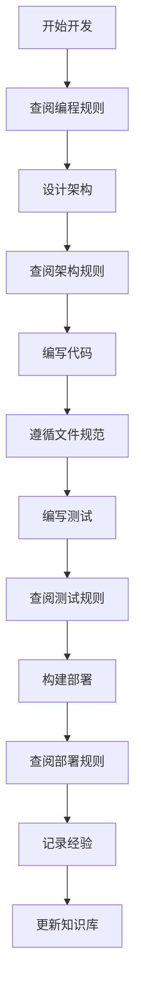
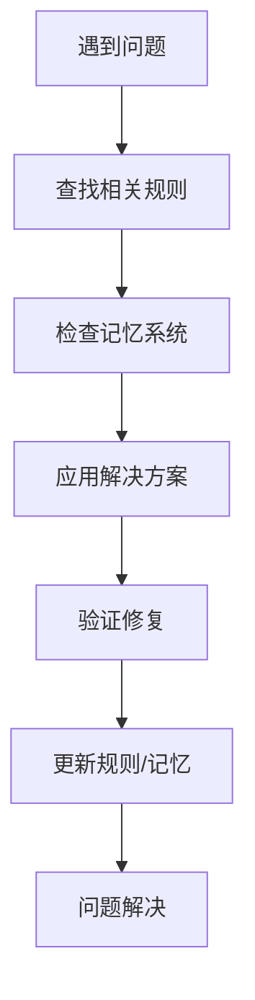

# 🎯 Claude Code Router 规则系统导航

## 📋 规则系统概览 (Rules System Overview)

本规则系统将原有的1700+行CLAUDE.md分解为结构化的规则管理框架，提供清晰的规则导航和分类管理。

### 🏗️ 规则分类架构
```
.claude/rules/
├── programming-rules.md        # 🔥 核心编程规范
├── architecture-rules.md       # 🏗️ 架构设计规则  
├── testing-system-rules.md     # 🧪 测试框架规范
├── file-structure-rules.md     # 📁 文件组织规范
├── deployment-rules.md         # 🚀 部署发布规则
├── memory-system-rules.md      # 🧠 知识管理规则
└── README.md                   # 📋 规则系统导航
```

## 🔥 核心规则优先级 (Rule Priority Matrix)

### 最高优先级 (Critical)
- **零硬编码原则**: 任何模型名称、API端点、配置值都不允许硬编码
- **零Fallback原则**: 不允许使用任何形式的fallback逻辑或默认值降级
- **用户确认规则**: npm和github提交必须获得用户明确确认

### 高优先级 (High)
- **细菌式编程**: Small(500行), Modular(四层架构), Self-contained(标准接口)
- **测试脚本化**: 所有测试必须通过脚本执行，禁止手动测试
- **配置驱动**: 所有行为通过配置文件控制，支持动态修改

### 中优先级 (Medium)
- **文件组织规范**: 严格按照四层架构和功能分类组织代码
- **构建完整性**: 完整构建必须成功，不使用fallback机制
- **性能监控**: 关键指标监控和性能回归检测

## 🎯 快速规则查找 (Quick Rule Lookup)

### 按开发阶段查找
| 开发阶段 | 主要规则 | 参考文档 |
|---------|---------|---------|
| **需求分析** | 架构原则、扩展性设计 | [架构设计规则](architecture-rules.md) |
| **编码实现** | 零硬编码、细菌式编程 | [核心编程规范](programming-rules.md) |
| **测试验证** | 测试脚本化、STD-6-STEP | [测试框架规范](testing-system-rules.md) |
| **文件组织** | 目录结构、命名规范 | [文件组织规范](file-structure-rules.md) |
| **构建部署** | 构建验证、发布检查 | [部署发布规则](deployment-rules.md) |
| **知识管理** | 经验记录、最佳实践 | [知识管理规则](memory-system-rules.md) |

### 按问题类型查找
| 问题类型 | 解决规则 | 具体章节 |
|---------|---------|---------|
| **硬编码问题** | 零硬编码原则 | programming-rules.md → 最高优先级禁令 |
| **架构设计** | 四层架构、Provider规范 | architecture-rules.md → 四层架构设计 |
| **测试失败** | STD-6-STEP-PIPELINE | testing-system-rules.md → 标准六步测试 |
| **文件混乱** | 目录结构标准 | file-structure-rules.md → 项目目录结构 |
| **构建错误** | 构建规则、依赖管理 | deployment-rules.md → 构建规则 |
| **知识遗失** | 记忆系统、ADR记录 | memory-system-rules.md → 记忆系统规则 |

## 🔄 规则使用工作流 (Rule Usage Workflow)

### 1. 项目开发工作流


### 2. 问题解决工作流


## 📚 规则详细说明 (Detailed Rule Descriptions)

### 🔥 [核心编程规范](programming-rules.md)
**核心内容**: 零硬编码、零Fallback、细菌式编程原则
- **最高优先级禁令**: 绝对不允许的编程行为
- **架构原则优先级**: 四个层次的优先级划分
- **实现规范**: 具体的代码实现要求和检查清单

### 🏗️ [架构设计规则](architecture-rules.md)
**核心内容**: 四层架构、Provider规范、路由机制
- **四层架构设计**: 输入→路由→输出→提供商的完整架构
- **Provider架构规范**: 统一接口和实现要求
- **负载均衡架构**: Round Robin和健康监控机制

### 🧪 [测试框架规范](testing-system-rules.md)
**核心内容**: 测试脚本化、STD-6-STEP-PIPELINE、文档同步
- **四大核心原则**: 测试必须遵循的基本原则
- **标准六步测试**: 新功能和问题调试的标准流程
- **测试文档规范**: 测试文档的标准格式和维护要求

### 📁 [文件组织规范](file-structure-rules.md)
**核心内容**: 目录结构标准、命名规范、文件创建规则
- **项目目录结构**: 完整的项目组织架构
- **四层架构源码**: src/目录的详细组织规范
- **测试目录规范**: test/目录的分类和命名标准

### 🚀 [部署发布规则](deployment-rules.md)
**核心内容**: 构建规则、发布检查、脚本自动化
- **发布前置规则**: 构建、测试、用户确认的强制要求
- **构建规则**: 零Fallback构建和依赖管理
- **脚本自动化**: 命令脚本化和工具规范

### 🧠 [知识管理规则](memory-system-rules.md)
**核心内容**: 记忆系统、ADR记录、经验积累
- **记忆系统目标**: 知识积累和经验传承机制
- **自动记忆触发**: 重要发现的自动记录机制
- **架构决策记录**: ADR格式和记录时机

## 🔧 规则维护和更新 (Rule Maintenance)

### 规则版本控制
- **版本同步**: 规则版本与项目版本保持同步
- **变更记录**: 所有规则变更都有明确的记录
- **影响评估**: 规则变更对现有代码的影响评估

### 规则质量保证
- **一致性检查**: 确保不同规则文件间的一致性
- **完整性验证**: 确保所有重要方面都有规则覆盖
- **可操作性**: 确保规则具体可执行，不是空泛的原则

### 规则使用反馈
- **使用统计**: 跟踪哪些规则被频繁查阅
- **问题收集**: 收集规则使用中的问题和建议
- **持续改进**: 基于反馈持续优化规则系统

## 🎯 规则系统的价值 (Rules System Value)

### 开发效率提升
- **决策加速**: 明确的规则减少决策时间
- **质量保证**: 标准化流程确保代码质量
- **知识传承**: 经验和最佳实践的系统性保存

### 项目可维护性
- **一致性**: 统一的编码和架构标准
- **可扩展性**: 清晰的扩展和集成规则
- **可追溯性**: 完整的决策和变更记录

### 团队协作优化
- **共同语言**: 统一的术语和概念定义
- **协作规范**: 明确的协作流程和责任分工
- **知识共享**: 系统化的知识管理和传播

---
**规则系统版本**: v2.6.0  
**设计者**: Claude Code (Rules Architecture Expert)  
**维护者**: Jason Zhang  
**最后更新**: 2025-08-01