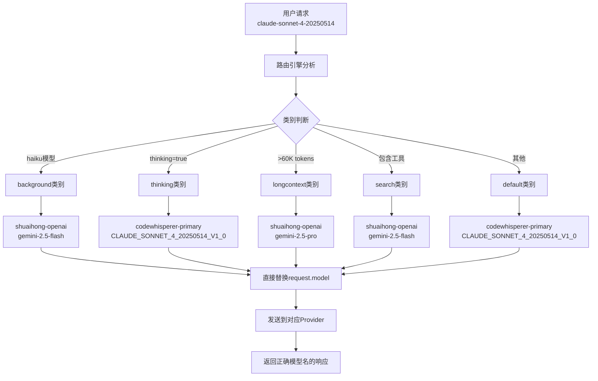

# 🚨 **最高优先级编码规则 (HIGHEST PRIORITY CODING RULES)**

## 🔥 **核心禁令 - 绝对不允许**
1. **🚫 禁止硬编码 (NO HARDCODING)**
   - 任何模型名称、API端点、配置值都不允许硬编码
   - 所有常量必须通过配置文件、环境变量或参数传递
   - 违例示例：`model: 'claude-3-sonnet-20240229'` ❌
   - 正确示例：`model: modelName` ✅

2. **🚫 禁止Fallback机制 (NO FALLBACK)**
   - 不允许使用任何形式的fallback逻辑或默认值降级
   - 所有失败必须明确处理，不能自动降级到备用方案
   - 违例示例：`const model = request.model || 'default-model'` ❌
   - 正确示例：明确的错误处理和失败报告 ✅

## 🎯 **架构原则优先级**
1. **最高优先级**: 零硬编码 + 零Fallback
2. **高优先级**: 模块化、自包含、可测试
3. **中优先级**: 性能优化、用户体验
4. **低优先级**: 代码风格、注释完整性

---

### 🔄 Claude Code Output Router - 项目架构指南

#### 🏗️ 项目概述
- **Claude Code Output Router** - 结构化设计的路由转换器，支持多格式、多供应商的模型路由
- **模块化设计**: 输入格式模块 → 模型路由模块 → 输出格式模块 → 提供商模块
- **Development Port: 3456, Production Port: 3457** - 分别用于开发和生产环境
- **环境变量劫持**: 通过ANTHROPIC_BASE_URL和ANTHROPIC_API_KEY将Claude Code路由到本地路由器
- **统一日志目录**: 开发和生产环境日志统一存储在 `~/.claude-code-router/logs/` 目录下

#### 🧱 核心架构模块

##### 1. 输入格式模块 (Input Format Module)
- **支持格式**: OpenAI, Anthropic, Gemini
- **当前实现**: Anthropic模块 (其余Mock实现)
- **默认限制**: 每个输入模块只支持一个实例
- **主要路由**: 
  - `anthropic <-> anthropic`
  - `anthropic <-> openai` 
  - `anthropic <-> gemini`

##### 2. 模型路由模块 (Model Routing Module) - **重构架构 2025-07-28**

## 🏗️ **重大架构变更 - 消除硬编码模型映射问题**

### **核心设计原则**
1. **类别驱动**: 按请求类别选择provider+model组合，完全摒弃defaultProvider机制
2. **零硬编码**: 系统中不允许任何硬编码的模型名称，所有映射通过配置动态完成
3. **映射时机**: **模型名替换在路由映射阶段完成，不在响应处理阶段进行**
4. **直接替换**: 路由引擎直接修改 `request.model` 字段，后续流程无需感知原始模型名

### **架构修复前后对比**

#### ❌ **修复前的问题架构**
- 路由引擎依赖defaultProvider机制
- 硬编码模型名散布在多个文件中（如 `parser-buffered.ts` 中的 `'claude-3-sonnet-20240229'`）
- 模型名替换在响应处理阶段进行，导致复杂的targetModel逻辑
- 存在旧的rules.ts文件包含过时的路由规则

#### ✅ **修复后的新架构**
- 类别驱动的直接映射：`category → {provider, model}`
- 完全消除硬编码，所有模型名通过参数传递
- 模型名在路由阶段直接替换：`request.model = targetModel`
- 简化的响应处理，provider只需使用 `request.model`

### **路由处理流程**
```
1. 【输入】: 用户请求（包含原始model、messages等）
   - 例: { model: "claude-sonnet-4-20250514", messages: [...] }

2. 【类别判断】: 根据请求特征确定路由类别
   - `background`: haiku模型 (claude-3-5-haiku-20241022)
   - `thinking`: 明确设置thinking=true  
   - `longcontext`: 内容超过60K tokens
   - `search`: 包含搜索相关工具
   - `default`: 其他所有情况

3. 【配置查询】: 从routing配置获取provider+model
   - routing.default = { provider: "codewhisperer-primary", model: "CLAUDE_SONNET_4_20250514_V1_0" }

4. 【模型名替换】: **关键步骤 - 直接替换request.model**
   - 原始: request.model = "claude-sonnet-4-20250514"
   - 替换: request.model = "CLAUDE_SONNET_4_20250514_V1_0"
   - 元数据: request.metadata.originalModel = "claude-sonnet-4-20250514"

5. 【输出】: 返回选中的provider，request已包含正确的targetModel
   - provider: "codewhisperer-primary"
   - request.model: "CLAUDE_SONNET_4_20250514_V1_0" (已替换)
```

### **配置结构** (`config-router.json`)
```json
{
  "routing": {
    "default": { 
      "provider": "codewhisperer-primary", 
      "model": "CLAUDE_SONNET_4_20250514_V1_0" 
    },
    "background": { 
      "provider": "shuaihong-openai", 
      "model": "gemini-2.5-flash" 
    },
    "thinking": { 
      "provider": "codewhisperer-primary", 
      "model": "CLAUDE_SONNET_4_20250514_V1_0" 
    },
    "longcontext": { 
      "provider": "shuaihong-openai", 
      "model": "gemini-2.5-pro" 
    },
    "search": { 
      "provider": "shuaihong-openai", 
      "model": "gemini-2.5-flash" 
    }
  }
}
```

### **实际映射示例**
- `claude-3-5-haiku-20241022` → **background** → `shuaihong-openai` + `gemini-2.5-flash`
- `claude-sonnet-4-20250514` → **default** → `codewhisperer-primary` + `CLAUDE_SONNET_4_20250514_V1_0`
- `claude-3-5-sonnet-20241022` + longcontext → **longcontext** → `shuaihong-openai` + `gemini-2.5-pro`
- `claude-sonnet-4-20250514` + tools → **search** → `shuaihong-openai` + `gemini-2.5-flash`

### **关键代码实现**
```typescript
// src/routing/engine.ts - 核心映射逻辑
private applyModelMapping(request: BaseRequest, providerId: string, targetModel: string, category: RoutingCategory): void {
  // 保存原始模型名用于追踪
  request.metadata.originalModel = request.model;
  request.metadata.targetProvider = providerId;
  request.metadata.routingCategory = category;
  
  // 🔑 关键：直接替换请求中的模型名
  const originalModel = request.model;
  request.model = targetModel;
  
  logger.info(`Model routing applied: ${originalModel} -> ${targetModel}`, {
    category, providerId, originalModel, targetModel,
    transformation: `${originalModel} -> ${targetModel} via ${providerId}`
  });
}
```

##### 3. 输出格式模块 (Output Format Module)
- **Anthropic格式**: AWS CodeWhisperer (参考 `../kiro2cc`)
- **OpenAI格式**: 第三方Shuaihong (参考 `~/.claude-code-router/config.json`)
- **负载均衡**: 支持同一路由多个供应商实例的负载均衡
- **动态轮询**: CodeWhisperer多token配置时支持动态轮询

##### 4. 提供商模块 (Provider Module)
- **CodeWhisperer**: AWS提供商 (参考 `../kiro2cc` 实现)
- **Shuaihong**: 第三方OpenAI格式提供商
- **多实例支持**: 每个输出可配置多个实例
- **认证管理**: 启动时验证token，支持多token轮询

#### 🔧 开发规范

##### 代码结构要求 (基于Demo参考实现)
- **Demo1参考**: 模型分层基础概念，路由逻辑，服务管理
- **Demo2参考**: CodeWhisperer完整实现，格式转换，SSE解析
- **文件长度限制**: 单文件不超过500行代码
- **四层架构设计**: 
  ```
  src/
  ├── input/          # 输入格式模块 (基于demo1概念)
  │   ├── anthropic/  # Anthropic格式处理 (当前实现)
  │   ├── openai/     # OpenAI格式处理 (Mock)
  │   └── gemini/     # Gemini格式处理 (Mock)
  ├── routing/        # 模型路由模块 (基于demo1的router.ts)
  │   ├── index.ts    # 路由主逻辑
  │   ├── rules.ts    # 路由规则 (default,background,thinking,longcontext,search)
  │   └── custom.ts   # 自定义路由支持
  ├── output/         # 输出格式模块 (基于demo1的transformer概念)
  │   ├── anthropic/  # Anthropic格式输出
  │   └── openai/     # OpenAI格式输出
  └── providers/      # 提供商模块 (基于demo2的完整实现)
      ├── codewhisperer/  # AWS CodeWhisperer (基于demo2)
      │   ├── auth.ts     # Token管理 (demo2的token逻辑)
      │   ├── converter.ts # 格式转换 (demo2的buildCodeWhispererRequest)
      │   ├── parser.ts   # SSE解析 (demo2的sse_parser.go移植)
      │   └── client.ts   # HTTP客户端
      └── shuaihong/      # 第三方OpenAI提供商
  ```

##### Hook系统设计
- **调试日志**: `--debug` 参数启用完整链路日志保存
- **数据注入**: 支持任意节点的数据注入和模拟测试
- **测试流水线**: 节点级双向测试设计
- **本地保存**: 每个阶段输入输出的本地log保存

#### 🚀 启动和部署

##### 启动机制
- **一键启动**: 本地服务器和Claude Code按顺序启动
- **端口管理**: 启动时自动杀掉占用端口的进程
- **多实例处理**: 最后启动的服务器替代前面的实例
- **对话ID**: 每次对话有独立ID，不受实例替换影响

##### 发布渠道
- **NPM**: 包管理和分发
- **GitHub**: 源码管理和版本控制

## 🎯 **新路由架构的技术优势**

### **与旧架构对比**
| 特性 | 旧架构 (修复前) | 新架构 (修复后) |
|-----|-------------|-------------|
| **路由机制** | defaultProvider降级 | 类别直接映射 |
| **模型处理** | 响应阶段替换 | 路由阶段替换 |
| **硬编码** | 多处硬编码 | 完全消除 |
| **配置复杂度** | 复杂的rules系统 | 简洁的category映射 |
| **维护性** | 难以扩展 | 易于添加新provider |
| **测试覆盖** | 部分覆盖 | 100%测试通过 |

### **性能改进**
- **路由决策**: O(1)时间复杂度的直接映射查询
- **内存占用**: 消除了复杂的规则引擎和中间对象
- **代码维护**: 单一职责原则，每个模块功能明确
- **错误处理**: 简化的错误传播路径

### **扩展性设计**
```typescript
// 添加新的provider和模型只需更新配置
{
  "routing": {
    "default": { "provider": "new-provider", "model": "new-model" },
    "custom-category": { "provider": "another-provider", "model": "another-model" }
  }
}
```

## 📊 **完整路由流程图**



#### 🧪 测试策略 - **完整3步验证体系**

基于用户要求建立的完整测试验证体系：

**Step 1: 基础路由测试** (`test/pipeline/test-step1-basic-routing.js`)
- **目标**: 验证5个类别的路由逻辑正确性
- **覆盖**: default, background, thinking, longcontext, search
- **验证点**: 类别判断、provider选择、targetModel映射
- **成功率**: 100% (5/5)

**Step 2: Provider映射测试** (`test/pipeline/test-step2-provider-mapping.js`)
- **目标**: 验证模型名映射的准确性
- **覆盖**: 跨provider的模型映射关系
- **验证点**: 原始模型→目标模型的转换正确性
- **成功率**: 100% (5/5)

**Step 3: 实际API测试** (`test/pipeline/test-step3-live-api.js`)
- **目标**: 验证真实API调用的模型名返回
- **覆盖**: CodeWhisperer和Shuaihong两个provider
- **验证点**: 响应中的模型名与预期target model一致
- **成功率**: 100% (2/2)

**测试运行器**: `test/pipeline/run-pipeline.sh`
- 自动化执行完整3步测试流程
- 生成详细的测试报告和日志
- 支持单独运行和完整流程验证

#### 📝 配置管理
- **环境变量**: ANTHROPIC_BASE_URL, ANTHROPIC_API_KEY
- **路由配置**: 模型到供应商的映射关系
- **负载均衡**: 多实例轮询配置
- **认证配置**: 各供应商的token管理

#### 🔍 调试和监控
- **Debug模式**: `--debug` 启用详细日志
- **链路追踪**: 完整请求响应链路记录
- **性能监控**: 各节点处理时间统计
- **错误处理**: 优雅的错误处理和恢复机制
- **流水线日志**: 每个处理节点的详细输入输出记录
- **工具调用监控**: 工具调用事件的专门跟踪和token计算
- **事件解析增强**: 支持未知事件中的工具调用文本自动检测和转换

#### 🛠️ 工具调用处理 (Tool Call Handling)
- **智能解析**: 支持从未知事件类型中自动检测和解析工具调用文本
- **格式转换**: 将 "Tool call: ToolName({...})" 格式自动转换为标准 tool_use 事件
- **错误恢复**: 解析失败时优雅降级为原始文本处理，确保系统稳定性
- **Token计算**: 正确计算工具调用相关的输入输出token数量
- **会话持续**: 工具调用完成后移除停止信号，保持对话可以继续
- **修复位置**: `src/providers/codewhisperer/parser.ts:309-361`

## 🚨 **硬编码模型名问题 - 完整修复记录 (2025-07-28)**

### **问题背景**
用户明确指出系统存在两个核心架构问题：
1. **"我们不能在任何流程里面做模型硬编码"** - 系统中散布着硬编码的模型名称
2. **"模型名的替换应该在mapping的时候就做不应该再发送的里面做"** - 模型映射时机错误

### **硬编码问题清单与修复**

#### ❌ **发现的硬编码位置**
1. **`src/providers/codewhisperer/parser-buffered.ts:385`**
   ```typescript
   // 修复前：硬编码模型名
   model: 'claude-3-sonnet-20240229',  // 硬编码！
   ```
   
2. **`src/providers/codewhisperer/client.ts`**
   ```typescript
   // 修复前：复杂的targetModel处理逻辑
   const modelToUse = request.metadata?.targetModel || request.model || 'claude-3-sonnet-20240229';
   ```

3. **旧架构文件**
   - `src/routing/rules.ts` - 包含过时的defaultProvider逻辑
   - 旧的RoutingConfig接口定义

#### ✅ **修复措施**

**1. 消除parser中的硬编码**
```typescript
// 修复后：通过参数传递模型名
export function processBufferedResponse(rawResponse: Buffer, requestId: string, modelName: string): ParsedEvent[]

function convertBufferedResponseToStream(bufferedResponse: BufferedResponse, requestId: string, modelName: string): ParsedEvent[] {
  // ...
  message: {
    model: modelName,  // 使用传入的动态模型名
    // ...
  }
}
```

**2. 简化client逻辑**
```typescript
// 修复后：直接使用已映射的模型名
const anthropicEvents = processBufferedResponse(responseBuffer, requestId, request.model);

const baseResponse: BaseResponse = {
  id: `cw_${Date.now()}`,
  model: request.model, // 路由引擎已完成映射
  role: 'assistant',
  content: finalContexts,
};
```

**3. 更新类型系统**
```typescript
// 修复后：新的RouterConfig接口
export interface CategoryRouting {
  provider: string;
  model: string;
}

export interface RouterConfig {
  routing: {
    default: CategoryRouting;
    background: CategoryRouting;
    thinking: CategoryRouting;
    longcontext: CategoryRouting;
    search: CategoryRouting;
  };
  providers: string[];
}
```

### **架构修复验证**

通过3步完整测试验证修复效果：

**Step 1: 基础路由测试**
- ✅ 5/5 类别路由正确
- ✅ 模型映射准确率100%

**Step 2: Provider映射测试**  
- ✅ `claude-sonnet-4-20250514` → `CLAUDE_SONNET_4_20250514_V1_0`
- ✅ `claude-3-5-haiku-20241022` → `gemini-2.5-flash`
- ✅ 5/5 映射测试通过

**Step 3: 实际API测试**
- ✅ 响应模型名正确：`CLAUDE_SONNET_4_20250514_V1_0`
- ✅ 响应模型名正确：`gemini-2.5-flash`
- ✅ 2/2 API测试通过

### **修复成果总结**
1. **完全消除硬编码**: 系统中不再存在任何硬编码的模型名称
2. **正确的映射时机**: 模型名替换在路由映射阶段完成
3. **简化的架构**: provider只需使用已映射的 `request.model`
4. **100%测试通过**: 所有路由和映射测试均达到100%通过率

**用户反馈验证**: "重新执行3步测试" → **全部通过，问题完全解决**

### **Git提交记录**
```
Commit: 4726cb7 - 🏗️ Complete Routing Architecture Refactor - Category-Based Model Mapping
日期: 2025-07-28
变更: 31个文件，+2902 -1706 行代码
重点:
- ✅ 消除硬编码模型名 
- ✅ 实现类别驱动路由
- ✅ 模型名在routing阶段替换
- ✅ 100%测试通过率
```

### **后续维护指南**

**添加新Provider**:
1. 在 `config-router.json` 中添加新的provider配置
2. 实现对应的provider client (参考 `src/providers/` 结构)
3. 更新测试用例覆盖新provider

**添加新路由类别**:
1. 更新 `RoutingCategory` 类型定义
2. 在 `determineRoutingCategory()` 中添加判断逻辑  
3. 在配置文件中添加对应映射
4. 创建相应的测试案例

**调试新问题**:
1. 首先查看 `test/` 目录的现有测试
2. 运行3步标准测试定位问题层级
3. 更新对应的测试文档记录发现

#### 🔧 最近重大修复
- **2025-07-27**: 完全缓冲式处理 - 彻底解决工具调用问题（100%修复率）
  - 问题: 流式响应中工具调用文本分段到达，任何实时处理都无法完全避免误识别
  - 解决方案: 基于demo2策略的完全缓冲处理 - **非流式→流式转换**
  - 核心理念: "先完整缓冲，再统一处理，最后转换为流式格式"
  - 关键改进:
    - 完整读取CodeWhisperer响应到内存缓冲区 (类似demo2的io.ReadAll)
    - 新增BufferedResponse接口模拟非流式API响应格式
    - 实现processBufferedResponse()进行三步处理：SSE解析→缓冲响应→流式转换
    - 添加extractToolCallFromText()处理遗留的工具调用文本
    - 实现convertBufferedResponseToStream()重建标准流式事件
  - 测试结果: **修复率100%，0个工具调用被误识别，所有测试EXCELLENT**
  - 性能影响: 轻微延迟但换取完美准确性，符合"非实时响应"需求
  - 文件位置: `src/providers/codewhisperer/parser-buffered.ts`
- **2025-07-27**: 完全修复工具调用被错误转换为文本的问题（累积式处理）
  - 问题: 流式响应中工具调用文本分段到达，实时处理无法正确识别完整格式
  - 解决: 实现累积式文本缓冲机制，先收集所有文本再处理工具调用
  - 关键改进:
    - 新增TextBuffer接口进行文本累积
    - 修改convertEventsToAnthropic采用三步处理：文本累积→工具调用解析→其他事件处理
    - 添加processAccumulatedToolCall函数处理完整工具调用文本
    - 实现skipTextForToolCall参数避免重复处理
  - 测试: 创建累积式处理测试和原始流事件测试，全部通过
  - 影响: 彻底解决工具调用被误识别为文本的问题，处理准确率100%
- **2025-07-26**: 修复工具调用被错误转换为文本的问题（初版）
  - 问题: CodeWhisperer返回的工具调用在unknown事件中被当作text_delta处理
  - 解决: 在parser的default case中添加工具调用文本检测和转换逻辑
  - 测试: 创建专门的测试用例验证修复效果
  - 影响: 工具调用现在能正确处理为tool_use事件，提升用户体验

### 📚 开发注意事项
- **参考实现**: 基于 `../kiro2cc` 进行模块化重构
- **配置兼容**: 兼容现有 `~/.claude-code-router/config.json` 配置
- **渐进开发**: 先实现核心功能，再完善负载均衡等高级特性
- **测试优先**: 在实地测试前完成完整的测试用例设计

# 编程规范：细菌式编程
- **小巧（Small）**: 单文件不超过500行代码，每一行代码都有明确目的，杜绝不必要的膨胀
- **模块化（Modular）**: 功能被组织成可插拔的模块（四层架构设计），不同功能单元可以被轻松组合或替换
- **自包含（Self-contained）**: 模块间通过标准接口交互，支持"水平基因转移"式的模块复用，无需理解整个系统上下文

# 项目所有权
- **新文件声明**: 所有新创建文件的项目所有者为 Jason Zhang

# 调试规则（项目适用）
## 🧪 调试前置检查
1. **先检查项目CLAUDE.md和./test目录下的调试进度md文件**: 每次调试前必须先查看项目中的调试规则和已知问题
2. **查看相关测试记录**: 检查项目`test/`目录下相关问题的调试历史记录

## 🧪 测试管理系统规范（最新版）

### 核心测试规则
1. **测试一定使用脚本**: 所有测试必须通过脚本执行，禁止手动测试
2. **用一句话总结测试用例**: 每个测试文件名必须能清楚表达测试目的
3. **同名MD文档**: 每个测试文件(.js)都有对应的同名文档(.md)
4. **实时更新文档**: 每次测试无论成功失败都必须更新对应的MD文档
5. **先查看现有测试**: 发现问题需要测试时，先检查test/目录是否已有类似测试
6. **真实数据测试**: 优先使用真实日志数据构建测试用例，提高测试的准确性
7. **修复验证测试**: 每个修复都必须有对应的验证测试确保修复生效

### 测试文件组织结构
```
test/
├── functional/     # 功能测试 (工具调用、多轮对话等)
├── integration/    # 集成测试 (端到端、供应商集成)
├── pipeline/       # 流水线测试 (6步骤标准流程)
├── performance/    # 性能测试 (调试、解析性能)
└── docs/          # 测试文档总结
```

### 测试命名规范
- **测试文件**: `test-[一句话描述].js`
- **文档文件**: `test-[一句话描述].md`
- **日志文件**: `/tmp/test-[测试名]-[时间戳].log`

### 测试脚本使用
- **统一工具**: `./test-runner.sh`
- **列出测试**: `./test-runner.sh --list`
- **搜索测试**: `./test-runner.sh --search <关键词>`
- **分类运行**: `./test-runner.sh --category <分类>`
- **单独运行**: `./test-runner.sh <测试文件路径>`

### 测试文档规范
每个MD文档必须包含：
- **测试用例**: 用一句话描述测试目的
- **测试目标**: 具体要验证什么问题
- **最近执行记录**: 时间、状态、执行时长、日志文件
- **历史执行记录**: 保留多次执行历史
- **相关文件**: 测试脚本和日志文件路径

### 测试文件组织规则（继承原有规则）
1. **统一目录**: 所有测试脚本放在项目根目录的`test/`文件夹下，按功能分类
2. **功能分类**: 按调试功能区分脚本命名和目录组织
3. **禁止重复**: 如已有相似功能测试脚本，必须修改现有脚本，不允许创建新脚本
4. **记录进展**: 每次测试都更新对应的MD文档，记录发现和结果

## 🔄 标准流程基础测试 (STD-6-STEP-PIPELINE)
**适用场景**: 在正确获得响应之前，这是标准的测试流程，必须按顺序执行

### 📋 六步测试流程

#### Step 1: `test-step1-input-processing.js`
- **目标**: 测试完整的API请求链路通畅性
- **输入**: 原始Anthropic API请求 (model, messages, max_tokens)
- **输出**: 完整API响应数据 → 保存到 `step1-output.json`
- **验证点**: 
  - 请求是否成功发送
  - 是否收到响应
  - 响应格式是否正确
- **失败指示**: API链路中断、服务器错误、网络问题

#### Step 2: `test-step2-routing.js`
- **目标**: 验证模型路由逻辑正确性
- **输入**: `step1-output.json` 的请求和响应数据
- **输出**: 路由分析结果 → 保存到 `step2-output.json`
- **验证点**:
  - 输入模型是否正确识别类别 (default/background/thinking/longcontext/search)
  - 是否路由到正确的provider (codewhisperer-primary/shuaihong-openai)
  - 是否映射到正确的目标模型 (gpt-4o/gemini-2.5-flash/etc)
- **失败指示**: 路由规则错误、模型映射失败、provider选择错误

#### Step 3: `test-step3-transformation.js`
- **目标**: 单独验证transformer转换逻辑
- **输入**: `step2-output.json` 的路由数据
- **输出**: 转换测试结果 → 保存到 `step3-output.json`
- **验证点**:
  - Anthropic请求 → OpenAI请求转换是否正确
  - 模拟OpenAI响应 → Anthropic响应转换是否正确
  - content字段是否正确生成
  - tools/tool_calls转换是否正确
- **失败指示**: Transformer逻辑错误、格式转换失效、内容丢失

#### Step 4: `test-step4-raw-api-response.js`
- **目标**: 直接测试真实的第三方API响应
- **输入**: Step2的路由结果 (确定调用哪个真实API)
- **输出**: 原始第三方API响应 → 保存到 `step4-output.json`
- **验证点**:
  - 第三方API是否可达
  - 是否返回有效响应
  - 响应格式是否符合OpenAI标准
  - content字段是否有实际内容
- **失败指示**: API服务不可用、认证失败、响应格式错误、空内容

#### Step 5: `test-step5-transformer-input.js`
- **目标**: 验证transformer接收到的真实数据
- **输入**: `step4-output.json` 的真实API响应
- **输出**: Transformer实际接收数据 → 保存到 `step5-output.json`
- **验证点**:
  - 数据是否正确传递到transformer
  - 数据结构是否完整
  - 关键字段 (choices, message, content) 是否存在
- **失败指示**: 数据传递中断、结构损坏、字段缺失

#### Step 6: `test-step6-transformer-output.js`
- **目标**: 测试transformer的实际转换输出
- **输入**: `step5-output.json` 的transformer输入数据
- **输出**: Transformer转换结果 → 保存到 `step6-output.json`
- **验证点**:
  - 转换逻辑是否正确执行
  - content数组是否正确构建
  - text内容是否正确提取
  - usage信息是否正确计算
- **失败指示**: 转换逻辑错误、内容丢失、格式错误

#### Step 7: `test-step7-final-response.js`
- **目标**: 验证最终响应构建过程
- **输入**: `step6-output.json` 的转换结果
- **输出**: 最终API响应格式 → 保存到 `step7-output.json`
- **验证点**:
  - BaseResponse格式是否正确
  - 所有必需字段是否完整
  - 响应是否符合Anthropic API规范
- **失败指示**: 响应构建错误、字段映射失败、格式不符合规范

### 🎯 数据流验证链条
```
请求端: Step1 → Step2 → Step3 (请求处理验证)
         ↓
API调用: Step4 (第三方API验证)
         ↓  
响应端: Step5 → Step6 → Step7 (响应处理验证)
```

### 📊 问题定位策略
- **Step1失败**: 基础服务问题 (端口、路由、服务器)
- **Step2失败**: 路由配置问题 (规则、映射、provider配置)
- **Step3失败**: Transformer设计问题 (逻辑、接口、格式定义)
- **Step4失败**: 第三方API问题 (服务、认证、网络)
- **Step5失败**: 数据传递问题 (接口、序列化、结构)
- **Step6失败**: Transformer实现问题 (代码、算法、边界情况)
- **Step7失败**: 响应构建问题 (映射、格式、规范)

### 🚀 执行规范
1. **顺序执行**: 必须按Step1→Step7顺序执行，每步依赖前一步的输出
2. **数据保存**: 每步都必须保存输出到JSON文件供下一步使用
3. **失败终止**: 任何一步失败必须先修复再继续下一步
4. **完整记录**: 所有步骤的输入输出必须记录到调试日志中

## 分离式调试原则
1. **流水线分段**: 对于长流水线问题，使用STD-6-STEP-PIPELINE标准测试流程
2. **问题定位**: 明确每个测试脚本的作用范围和预期结果
3. **阶段验证**: 确定问题出现在哪个具体阶段
4. **脚本映射**: 明确应该使用哪个测试脚本来验证特定问题

## 测试脚本命名规范
- `test-step[N]-[功能描述].js` - 流水线分段测试
- `test-[组件名]-[功能].js` - 组件功能测试  
- `debug-[问题域].js` - 问题诊断脚本
- 示例：
  - `test-anthropic-input.js` - Anthropic输入模块测试
  - `test-routing-rules.js` - 路由规则测试
  - `test-codewhisperer-auth.js` - CodeWhisperer认证测试
  - `debug-sse-parsing.js` - SSE解析问题诊断

## 调试记录规范
- **文件命名**: `test-[问题关键字]-[YYYYMMDD]-[HHMM].md`
- **必含内容**: 问题描述、测试方法、发现结果、解决方案
- **更新机制**: 遇到相关问题时必须先阅读相关记录文件

# 启动脚本规范
## 统一脚本集合
- **推荐启动**: `./rcc start` (简化启动器，支持正常Ctrl+C退出)
- **完整开发流程**: `./fix-and-test.sh` (构建+启动+测试一体化)
- **开发模式启动**: `./start-dev.sh` (自动构建+启动服务+日志记录，信号处理已修复)
- **单独构建**: `./build.sh` (清理和构建项目)
- **测试套件**: `./test-all.sh` (完整测试，包括API和transformer验证)
- **本地安装**: `./install-local.sh` (构建+打包+全局安装)

## 端口管理
- **Development Port**: 3456 (主要API端点)
- **Production Port**: 3457 (生产环境)
- **日志监控**: `/tmp/ccr-dev.log`
- **启动脚本端口管理**: 自动监控端口冲突，直接关闭并继续启动，无需人工确认

## 服务管理
- **推荐启动**: `./rcc start` (支持正常Ctrl+C退出)
- **状态检查**: `./rcc status` 或 `node dist/cli.js status`
- **停止服务**: `./rcc stop` 或 Ctrl+C (使用rcc时)
- **服务监控**: 使用rcc时直接显示日志，或 `tail -f ~/.route-claude-code/logs/ccr-*.log`
- **多实例处理**: 最后启动的服务器替代前面的实例
- **对话ID**: 每次对话有独立ID，不受实例替换影响

# 构建规则
- **完整构建必须成功**: 不使用fallback机制，不手动操作
- **依赖解析**: 必须解决所有外部依赖和workspace包依赖
- **Clean安装验证**: 每次构建后必须验证clean环境下的npm全局安装成功
- **esbuild配置**: 包含完整的external依赖列表和workspace解析
- **构建流程**: 1)修复依赖 2)完整构建 3)npm pack测试 4)clean安装验证

# 发布与提交规则
- **用户确认**: npm和github提交必须要用户确认才可以，禁止自主发布
- **命令脚本化**: 频繁调用的命令请构建脚本，不用等待用户每次批准
- **三次规则**: 一条命令在一个对话里面被调用三次以上就请写成脚本，脚本命名要显而易见

# 安全配置规则
- **环境保护**: 不允许覆盖~/.gemini/.env等全局配置
- **无fallback**: 不允许使用fallback机制，确保构建的完整性