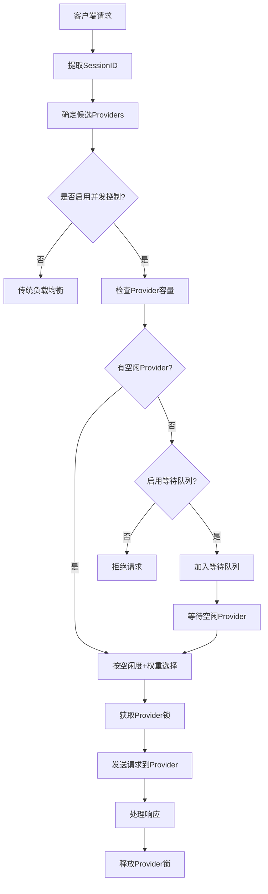

# 🔐 并发控制功能详解 - Claude Code Router Enhanced

## 📋 功能概述

Claude Code Router现在支持**智能并发控制**，专门解决单服务器多客户端访问时的**资源竞争和provider过载问题**。通过引入锁机制和占用状态跟踪，确保每个provider在其承载能力范围内提供稳定服务。

## 🚨 **解决的核心问题**

### ❌ **原有问题**
1. **无并发限制**: 多个客户端可能同时占用同一provider，导致过载
2. **资源竞争**: 高权重provider被过度使用，低权重provider空闲
3. **响应质量下降**: Provider过载时响应时间增加，成功率降低
4. **无状态负载均衡**: 不考虑provider当前负载情况

### ✅ **解决方案**
1. **严格并发控制**: 每个provider设置最大并发数限制
2. **智能负载分配**: 优先选择空闲或负载较低的provider
3. **锁机制**: 基于session的provider占用锁，防止资源竞争
4. **实时监控**: 完整的并发状态和性能指标

## 🏗️ **架构设计**

### 📊 **核心组件**

```
┌─────────────────┐    ┌──────────────────┐    ┌────────────────┐
│  Client A       │    │  Client B        │    │  Client C      │
│  (Session-1)    │    │  (Session-2)     │    │  (Session-3)   │
└─────────┬───────┘    └─────────┬────────┘    └────────┬───────┘
          │                      │                      │
          └──────────────────────┼──────────────────────┘
                                 │
        ┌───────────────────────────────────────────────┐
        │           ConcurrencyManager                  │
        │  ┌─────────────────────────────────────────┐  │
        │  │     Provider Occupancy States           │  │
        │  │  ┌─────────┐ ┌─────────┐ ┌─────────┐   │  │
        │  │  │Provider │ │Provider │ │Provider │   │  │
        │  │  │   A     │ │   B     │ │   C     │   │  │
        │  │  │ 2/3 🔒  │ │ 0/2 ✅  │ │ 1/1 🔒  │   │  │
        │  │  └─────────┘ └─────────┘ └─────────┘   │  │
        │  └─────────────────────────────────────────┘  │
        └───────────────────────────────────────────────┘
                                 │
        ┌───────────────────────────────────────────────┐
        │          LoadBalancing Engine                 │
        │     (Concurrency-Aware Selection)            │
        └───────────────────────────────────────────────┘
```

### 🔧 **关键概念**

#### **Provider占用状态 (ProviderOccupancyState)**
```typescript
interface ProviderOccupancyState {
  providerId: string;
  activeConnections: number;      // 当前活跃连接数
  maxConcurrency: number;         // 最大并发数限制
  waitingQueue: string[];         // 等待队列 (sessionId)
  lastActivity: Date;             // 最后活动时间
}
```

#### **会话锁 (Session Lock)**
- 每个客户端会话(session)最多占用一个provider
- 基于sessionId进行锁管理，避免同一客户端重复占用
- 自动超时释放，防止资源泄漏

#### **智能选择算法**
- **空闲优先**: 优先选择有空闲容量的provider
- **权重感知**: 在空闲provider中按权重分配
- **负载均衡**: 避免单个provider过载

## ⚙️ **配置参数**

### 📋 **ConcurrentLoadBalancingConfig**

```json
{
  "concurrency": {
    "enabled": true,
    "maxConcurrencyPerProvider": 3,
    "lockTimeoutMs": 300000,
    "queueTimeoutMs": 60000,
    "enableWaitingQueue": true,
    "preferIdleProviders": true
  }
}
```

**参数说明:**
- **enabled**: 是否启用并发控制
- **maxConcurrencyPerProvider**: 每个provider最大并发数 (默认3)
- **lockTimeoutMs**: 锁超时时间，毫秒 (默认5分钟)
- **queueTimeoutMs**: 队列等待超时时间 (默认1分钟)
- **enableWaitingQueue**: 是否启用等待队列
- **preferIdleProviders**: 是否优先选择空闲provider

## 🚀 **工作流程**

### 🔄 **请求处理流程**



### 🔒 **锁管理机制**

1. **获取锁** (`acquireProviderLock`)
   - 检查provider容量是否可用
   - 验证session是否已持有其他锁
   - 更新provider占用状态
   - 设置自动超时释放

2. **释放锁** (`releaseProviderLock`)
   - 减少provider活跃连接数
   - 清理session锁记录
   - 处理等待队列中的下一个请求
   - 清除超时定时器

## 📊 **负载均衡策略 (并发感知版本)**

### 🎯 **1. Weighted (权重 + 并发感知)**

**选择逻辑:**
```javascript
// 1. 按空闲容量排序
const availableProviders = providers.filter(p => 
  p.activeConnections < p.maxConcurrency
);

// 2. 在空闲provider中按权重分配
const sortedByAvailability = availableProviders.sort((a, b) => {
  const availabilityA = a.maxConcurrency - a.activeConnections;
  const availabilityB = b.maxConcurrency - b.activeConnections;
  
  if (availabilityA !== availabilityB) {
    return availabilityB - availabilityA; // 空闲容量优先
  }
  
  return b.weight - a.weight; // 权重优先
});
```

**效果:**
- ✅ 避免provider过载
- ✅ 保持权重分配比例
- ✅ 最大化资源利用率

### 🔄 **2. Round Robin (轮询 + 可用性检查)**

**选择逻辑:**
```javascript
// 按轮询顺序尝试获取可用provider
for (const provider of orderedProviders) {
  if (provider.activeConnections < provider.maxConcurrency) {
    return acquireLock(provider);
  }
}
```

**效果:**
- ✅ 均匀分配请求
- ✅ 跳过已满载的provider
- ✅ 保持轮询公平性

### 🏥 **3. Health Based (健康状态 + 负载感知)**

**综合评分:**
```javascript
const finalScore = (healthScore * 0.7) + (concurrencyScore * 0.3);

// healthScore: 基于成功率和错误数
// concurrencyScore: 1 - utilizationRate (空闲度)
```

**效果:**
- ✅ 选择最健康的provider
- ✅ 避免高负载provider
- ✅ 自适应负载分配

## 🧪 **实际使用示例**

### 📝 **场景1: 双CodeWhisperer并发控制**

```json
{
  "default": {
    "providers": [
      {
        "provider": "kiro-zcam",
        "model": "CLAUDE_SONNET_4_20250514_V1_0",
        "weight": 70
      },
      {
        "provider": "kiro-gmail", 
        "model": "CLAUDE_SONNET_4_20250514_V1_0",
        "weight": 30
      }
    ],
    "loadBalancing": {
      "enabled": true,
      "strategy": "weighted"
    }
  },
  "concurrency": {
    "maxConcurrencyPerProvider": 2
  }
}
```

**并发场景处理:**
```
Client-1 → kiro-zcam (1/2) ✅
Client-2 → kiro-zcam (2/2) ✅  
Client-3 → kiro-gmail (1/2) ✅ (kiro-zcam满载)
Client-4 → kiro-gmail (2/2) ✅
Client-5 → 等待队列 ⏳ (所有provider满载)
```

### 🔍 **场景2: 混合Provider智能分配**

```json
{
  "search": {
    "providers": [
      {
        "provider": "shuaihong-openai",
        "model": "gemini-2.5-pro",
        "weight": 80
      },
      {
        "provider": "backup-gpt",
        "model": "gpt-4o", 
        "weight": 20
      }
    ]
  },
  "concurrency": {
    "maxConcurrencyPerProvider": 3,
    "preferIdleProviders": true
  }
}
```

**智能分配效果:**
```
高负载时段:
  shuaihong-openai: 3/3 (100% 利用率) 🔴
  backup-gpt: 2/3 (67% 利用率) 🟡
  
新请求 → backup-gpt (优先空闲)
```

## 📈 **监控和指标**

### 🔍 **实时状态查询**

```javascript
// 获取占用状态快照
const snapshot = routingEngine.getConcurrencySnapshot();
console.log(snapshot);

/*
输出示例:
{
  "kiro-zcam": {
    "activeConnections": 2,
    "maxConcurrency": 3,
    "utilizationRate": "66.7%",
    "queueLength": 1,
    "isAvailable": true
  },
  "shuaihong-openai": {
    "activeConnections": 3,
    "maxConcurrency": 3, 
    "utilizationRate": "100.0%",
    "queueLength": 3,
    "isAvailable": false
  }
}
*/
```

### 📊 **详细性能指标**

```javascript
const metrics = concurrencyManager.getProviderMetrics('provider-id');
console.log(metrics);

/*
输出示例:
{
  "providerId": "kiro-zcam",
  "currentLoad": 2,
  "maxConcurrency": 3,
  "utilizationRate": 0.667,
  "queueLength": 1,
  "idleTime": 1500
}
*/
```

## 🚨 **错误处理和降级**

### ⚠️ **常见场景**

1. **所有Provider满载**
   ```
   结果: 如果启用队列 → 等待；否则 → 拒绝请求
   日志: "All providers occupied, request queued/rejected"
   ```

2. **锁超时**
   ```
   结果: 自动释放锁，处理等待队列
   日志: "Lock timeout for session: session-123"
   ```

3. **Provider不健康且满载**
   ```
   结果: 跳过该provider，尝试下一个
   日志: "Provider unhealthy and occupied, skipping"
   ```

### 🛡️ **降级策略**

```javascript
// 1. 并发控制失败 → 传统负载均衡
if (!concurrentSelectionSuccess) {
  return traditionalWeightedSelection(providers);
}

// 2. 所有provider占用 → 第一个provider (强制)
if (allProvidersOccupied) {
  logger.warn('Forcing request to first provider despite occupancy');
  return providers[0];
}
```

## 🔧 **最佳实践**

### ✅ **推荐配置**

1. **生产环境配置**
   ```json
   {
     "maxConcurrencyPerProvider": 3,
     "lockTimeoutMs": 300000,
     "enableWaitingQueue": true,
     "preferIdleProviders": true
   }
   ```

2. **高流量场景**
   ```json
   {
     "maxConcurrencyPerProvider": 5,
     "lockTimeoutMs": 180000,
     "enableWaitingQueue": false,
     "preferIdleProviders": true
   }
   ```

3. **开发测试环境**
   ```json
   {
     "maxConcurrencyPerProvider": 1,
     "lockTimeoutMs": 60000,
     "enableWaitingQueue": true
   }
   ```

### 📋 **运维建议**

1. **监控指标**
   - Provider利用率保持在70-80%以下
   - 等待队列长度监控
   - 锁超时频率统计

2. **告警设置**
   - 所有provider满载 > 1分钟
   - 单provider利用率 > 90%
   - 等待队列长度 > 10

3. **容量规划**
   - 根据QPS调整maxConcurrencyPerProvider
   - 预留20-30%容量buffer
   - 定期评估provider性能

## 🎯 **迁移指南**

### 🔄 **启用并发控制**

**步骤1: 更新配置**
```json
{
  "routing": {
    "default": {
      "providers": [...],
      "loadBalancing": {
        "enabled": true,
        "strategy": "weighted"
      }
    }
  },
  "concurrency": {
    "enabled": true,
    "maxConcurrencyPerProvider": 3
  }
}
```

**步骤2: 验证效果**
```bash
# 查看并发状态
curl http://localhost:3456/status

# 监控日志
tail -f ~/.route-claude-code/logs/main.log | grep "Concurrent"
```

**步骤3: 调优参数**
- 观察利用率指标
- 调整maxConcurrency
- 根据业务需求启用/禁用队列

---

## 🎉 **功能优势总结**

### 🚀 **核心价值**

1. **🛡️ 稳定性提升**
   - Provider过载保护
   - 优雅的资源竞争处理
   - 自动故障恢复

2. **⚖️ 公平性保证** 
   - 基于capacity的智能分配
   - 防止资源垄断
   - 保持权重比例

3. **📊 可观测性**
   - 实时并发状态监控
   - 详细性能指标
   - 完整的请求链路追踪

4. **🔧 灵活配置**
   - 可配置并发限制
   - 多种负载均衡策略
   - 渐进式启用

**现在您的Claude Code Router具备了企业级的并发控制能力！** 🚀