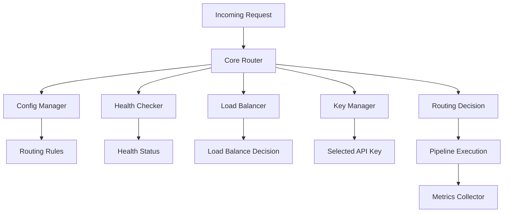

# RCC4 路由器架构重新设计方案

## 📋 职责混乱问题分析

### 当前问题诊断

通过分析 `HybridMultiProviderRouter` 和 `IntelligentKeyRouter` 的代码，发现以下关键问题：

1. **路由器包含协议转换功能** ❌
   - 路由器不应该有任何数据格式转换逻辑
   - 转换应该由专门的 Transformer 模块处理

2. **负载均衡逻辑混合在路由器中** ❌
   - 路由决策和负载均衡策略耦合
   - 缺乏独立的负载均衡器接口

3. **健康检查逻辑内嵌** ❌
   - 健康检查应该是独立的监控服务
   - 路由器应该消费健康状态，而不是执行检查

4. **配置管理分散** ❌
   - 配置验证和管理分散在各个组件中
   - 缺乏统一的配置管理接口

5. **统计和监控功能混合** ❌
   - 路由器承担了过多的统计记录职责
   - 应该有专门的监控和指标收集器

## 🎯 重新设计的架构原则

### 核心设计原则

1. **单一职责原则**
   - 每个模块只负责一项核心功能
   - 路由器ONLY做路由决策

2. **接口隔离原则**
   - 定义清晰的模块间接口
   - 避免大而全的接口设计

3. **依赖注入原则**
   - 通过构造函数注入依赖
   - 便于测试和模块替换

4. **零Fallback策略遵循**
   - 失败时立即抛出错误
   - 不进行任何形式的降级处理

## 🏗️ 新架构模块划分

### 1. 核心路由器 (Core Router)

**职责**: 纯粹的路由决策逻辑
- 输入：请求信息 + 路由配置
- 输出：路由决策结果（选择哪个Provider/Pipeline）
- 不包含：转换、负载均衡、健康检查、统计

```typescript
interface CoreRouter {
  route(request: RoutingRequest): Promise<RoutingDecision>;
  updateRoutingRules(rules: RoutingRules): void;
  getAvailableRoutes(): RouteInfo[];
}
```

### 2. 负载均衡器 (Load Balancer)

**职责**: 独立的负载均衡策略实现
- 轮询、加权、最少连接等策略
- 动态权重调整
- 流量分发优化

```typescript
interface LoadBalancer {
  select(candidates: ProviderCandidate[], strategy: LoadBalanceStrategy): ProviderCandidate;
  updateWeights(weights: Map<string, number>): void;
  getMetrics(): LoadBalanceMetrics;
}
```

### 3. 健康检查器 (Health Checker)

**职责**: 独立的健康监控服务
- 定期检查Provider可用性
- 健康状态评估和报告
- 故障检测和恢复监控

```typescript
interface HealthChecker {
  checkHealth(providerId: string): Promise<HealthStatus>;
  startMonitoring(): void;
  stopMonitoring(): void;
  getHealthStatus(providerId: string): HealthStatus;
  subscribeToHealthChanges(callback: HealthChangeCallback): void;
}
```

### 4. 配置管理器 (Config Manager)

**职责**: 统一的配置管理
- 配置加载和验证
- 动态配置更新
- 配置版本管理

```typescript
interface ConfigManager {
  loadConfig(source: ConfigSource): Promise<RouterConfig>;
  validateConfig(config: RouterConfig): ValidationResult;
  updateConfig(config: RouterConfig): Promise<void>;
  watchConfig(callback: ConfigChangeCallback): void;
}
```

### 5. API Key管理器 (Key Manager)

**职责**: API Key轮询和管理
- Key状态跟踪
- 速率限制处理
- Key冷却管理

```typescript
interface KeyManager {
  selectKey(providerId: string, priority: RequestPriority): Promise<ApiKeyInfo>;
  recordKeyUsage(keyId: string, result: KeyUsageResult): void;
  getKeyStatus(keyId: string): KeyStatus;
  isKeyAvailable(keyId: string): boolean;
}
```

### 6. 监控收集器 (Metrics Collector)

**职责**: 统计和监控数据收集
- 请求统计
- 性能指标
- 错误率监控

```typescript
interface MetricsCollector {
  recordRequest(request: RequestMetrics): void;
  recordResponse(response: ResponseMetrics): void;
  recordError(error: ErrorMetrics): void;
  getMetrics(timeRange: TimeRange): SystemMetrics;
}
```

## 🔗 模块交互流程

### 路由决策流程

```
1. [Request] → CoreRouter.route()
2. CoreRouter → ConfigManager.getRoutingRules()
3. CoreRouter → HealthChecker.getHealthStatus()
4. CoreRouter → LoadBalancer.select()
5. CoreRouter → KeyManager.selectKey()
6. CoreRouter → return RoutingDecision
7. [Response Processing] → MetricsCollector.record()
```

### 数据流向图



## 📁 重新设计的文件结构

```
src/modules/router/
├── core/
│   ├── core-router.ts           # 核心路由器实现
│   ├── routing-engine.ts        # 路由决策引擎
│   └── route-matcher.ts         # 路由规则匹配器
├── load-balancer/
│   ├── load-balancer.ts         # 负载均衡器接口
│   ├── strategies/
│   │   ├── round-robin.ts       # 轮询策略
│   │   ├── weighted.ts          # 加权策略
│   │   └── least-connections.ts # 最少连接策略
│   └── load-balance-manager.ts  # 负载均衡管理器
├── health-checker/
│   ├── health-checker.ts        # 健康检查器接口
│   ├── provider-health-monitor.ts # Provider健康监控
│   ├── health-status-manager.ts # 健康状态管理
│   └── recovery-manager.ts      # 恢复状态管理
├── config-manager/
│   ├── config-manager.ts        # 配置管理器接口
│   ├── config-loader.ts         # 配置加载器
│   ├── config-validator.ts      # 配置验证器
│   └── config-watcher.ts        # 配置监听器
├── key-manager/
│   ├── key-manager.ts           # Key管理器接口
│   ├── key-selector.ts          # Key选择器
│   ├── key-rotation.ts          # Key轮询管理
│   └── rate-limit-handler.ts    # 速率限制处理
├── metrics/
│   ├── metrics-collector.ts     # 指标收集器接口
│   ├── request-tracker.ts       # 请求跟踪器
│   ├── performance-monitor.ts   # 性能监控器
│   └── error-tracker.ts         # 错误跟踪器
└── index.ts                     # 统一导出
```

## 🎯 接口设计规范

### 统一错误处理

```typescript
// 零Fallback策略错误类型
export class RouterError extends Error {
  constructor(
    message: string,
    public readonly code: string,
    public readonly context?: Record<string, any>
  ) {
    super(message);
    this.name = 'RouterError';
  }
}

export class ProviderUnavailableError extends RouterError {
  constructor(providerId: string, reason: string) {
    super(
      `Provider ${providerId} is unavailable: ${reason}`,
      'PROVIDER_UNAVAILABLE',
      { providerId, reason }
    );
  }
}

export class NoHealthyProvidersError extends RouterError {
  constructor(providers: string[]) {
    super(
      `No healthy providers available: ${providers.join(', ')}`,
      'NO_HEALTHY_PROVIDERS',
      { providers }
    );
  }
}
```

### 标准化数据结构

```typescript
// 路由请求
export interface RoutingRequest {
  readonly id: string;
  readonly model: string;
  readonly category?: string;
  readonly priority: 'high' | 'normal' | 'low';
  readonly metadata: RequestMetadata;
  readonly constraints?: RoutingConstraints;
}

// 路由决策结果
export interface RoutingDecision {
  readonly requestId: string;
  readonly selectedProvider: string;
  readonly selectedModel: string;
  readonly selectedKey: ApiKeyInfo;
  readonly reasoning: string;
  readonly confidence: number;
  readonly estimatedLatency: number;
  readonly decisionTime: Date;
}

// API Key信息
export interface ApiKeyInfo {
  readonly keyId: string;
  readonly keyIndex: number;
  readonly providerId: string;
  readonly priority: 'high' | 'medium' | 'low';
  readonly remainingQuota?: number;
  readonly cooldownUntil?: Date;
}

// 健康状态
export interface HealthStatus {
  readonly providerId: string;
  readonly isHealthy: boolean;
  readonly healthScore: number; // 0-100
  readonly responseTime: number;
  readonly errorRate: number; // 0-1
  readonly lastChecked: Date;
  readonly consecutiveFailures: number;
  readonly details?: Record<string, any>;
}
```

## ⚙️ 配置结构重新设计

### 路由器配置

```typescript
export interface RouterConfig {
  routing: {
    defaultStrategy: 'weighted' | 'round-robin' | 'least-connections';
    rules: RoutingRule[];
    categories: Record<string, CategoryConfig>;
  };
  
  loadBalancing: {
    strategy: LoadBalanceStrategy;
    weights?: Record<string, number>;
    healthThreshold: number;
  };
  
  healthCheck: {
    enabled: boolean;
    interval: number;
    timeout: number;
    retryAttempts: number;
    healthyThreshold: number;
    unhealthyThreshold: number;
  };
  
  keyManagement: {
    rotationStrategy: 'round-robin' | 'priority-based' | 'load-based';
    cooldownDuration: number;
    maxRetriesPerKey: number;
    rateLimitHandling: RateLimitConfig;
  };
  
  monitoring: {
    metricsEnabled: boolean;
    historyRetention: number;
    alertThresholds: AlertConfig;
  };
  
  // 零Fallback策略配置
  zeroFallbackPolicy: {
    enabled: true; // 强制启用
    strictMode: boolean;
    errorOnFailure: boolean;
  };
}
```

## 🔧 实施策略

### 阶段一：接口定义 (Week 1)
1. 定义所有模块接口
2. 创建核心数据结构
3. 实现错误类型系统
4. 建立模块测试框架

### 阶段二：核心模块实现 (Week 2)
1. 实现CoreRouter
2. 实现ConfigManager  
3. 实现基本的LoadBalancer策略
4. 集成测试基础框架

### 阶段三：监控和管理模块 (Week 3)
1. 实现HealthChecker
2. 实现KeyManager
3. 实现MetricsCollector
4. 完整集成测试

### 阶段四：优化和扩展 (Week 4)
1. 性能优化
2. 高级负载均衡策略
3. 动态配置支持
4. 监控Dashboard

## 🧪 测试策略

### 单元测试
- 每个模块独立测试
- Mock所有依赖接口
- 覆盖率要求: 90%+

### 集成测试
- 模块间交互测试
- 完整路由流程测试
- 错误场景测试

### 端到端测试
- 真实Provider连接测试
- 性能基准测试
- 故障恢复测试

## 📊 成功指标

### 性能指标
- 路由决策时间 < 10ms
- 内存使用 < 100MB
- 并发支持 > 1000 requests/sec

### 质量指标
- 零静默失败
- 错误恢复时间 < 30s
- 配置变更生效时间 < 5s

### 可维护性指标
- 模块独立性 > 95%
- 接口稳定性 > 98%
- 文档覆盖率 > 90%

---

**设计原则确认**:
- ✅ 路由器只做路由决策，不做协议转换
- ✅ 负载均衡完全分离为独立模块
- ✅ 健康检查、配置管理、监控全部模块化
- ✅ 严格遵循零Fallback策略
- ✅ 接口清晰，职责单一，易于测试和扩展